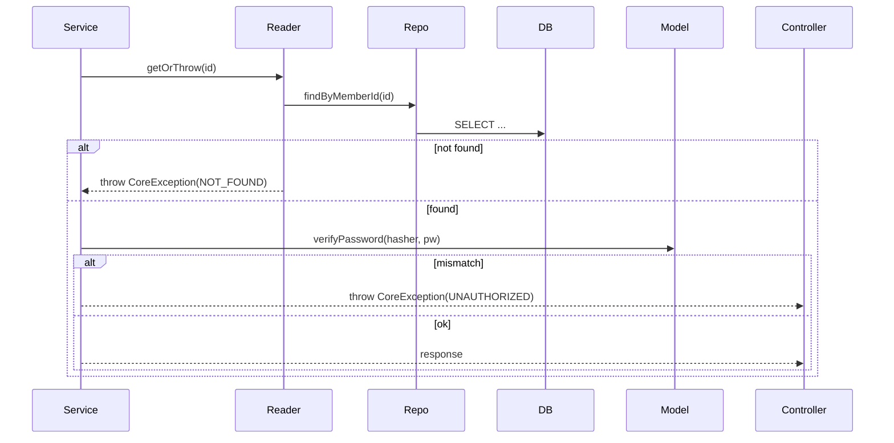
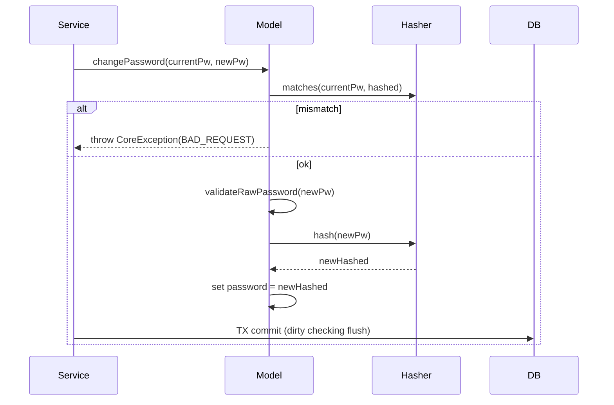

# PR 생성 가이드

## 개요

기능 구현이 완료된 후, 코드를 분석하고 개발자의 의사결정을 확인하여 PR 문서를 작성하는 3단계 워크플로우입니다.

---

## 워크플로우

### 전체 흐름

```
[Step 1] volume-{n}.md          깃 로그 + 코드 분석 → 개발 기록 정리
    ↓
[Step 2] volume-{n}-question.md 코드에서 의사결정 의문점 도출 → 개발자 답변 수집
    ↓
[Step 3] volume-{n}-pr.md       답변 반영 + 코드 수정(필요 시) → 최종 PR 문서 생성
```

저장 경로: `.idea/volume-{n}*.md`

---

### Step 1: 개발 기록 작성 (`volume-{n}.md`)

브랜치의 커밋 히스토리와 변경 파일을 분석하여 개발 흐름을 Phase 단위로 정리한다.

#### 수집 정보

1. **커밋 히스토리**: `git log {base}..HEAD` — 해시, 날짜, 메시지 테이블
2. **변경 통계**: `git diff {base}..HEAD --shortstat` — 파일 수, 추가/삭제 라인
3. **커밋별 변경**: `git log {base}..HEAD --stat` — 각 커밋의 영향 파일

#### 구성

```markdown
# Volume {n} - {도메인} 구현 기록

## 개요
시작 커밋 ~ 종료 커밋 범위, 총 변경 통계

## 커밋 히스토리
| Hash | 날짜 | 커밋 메시지 |

## Phase 1: {주제}
- 변경 내용, 추가된 클래스/메서드, 테스트

## Phase N: ...

## 최종 파일 구조
프로덕션 코드 트리

## API 엔드포인트 현황
| Method | Path | 설명 | 인증 |

## 테스트 현황
| 종류 | 클래스 | 테스트 수 |

## 아키텍처 패턴 요약
적용된 패턴, 리팩토링 포인트
```

#### Phase 분류 기준

- 관련된 커밋을 기능/레이어 단위로 묶는다
- 예: VO 구축 → 서비스 레이어 → API 레이어 → 리팩토링

---

### Step 2: 의사결정 질문 (`volume-{n}-question.md`)

코드를 전수 분석하여 설계/구현 의도가 불분명한 부분을 질문한다.

#### 질문 도출 관점

| 관점 | 예시 |
|------|------|
| **레이어 규칙 위반** | Domain에서 Infrastructure를 import하고 있는가? |
| **타입 설계 일관성** | 일부 필드만 VO로 래핑하고 나머지는 원시 타입인 이유? |
| **중복/비효율 로직** | 같은 검증이 여러 곳에서 실행되는가? |
| **미사용 코드** | 테스트에서만 쓰이는 생성자/메서드가 있는가? |
| **규칙 불일치** | CLAUDE.md의 규칙과 실제 코드가 어긋나는 곳? |
| **HTTP 시맨틱** | 에러 코드/응답 코드가 의미에 맞는가? |
| **캡슐화 수준** | 내부 상태(getter)가 불필요하게 노출되는가? |

#### 질문 형식

```markdown
## {번호}. {주제 한 줄}

{현상 설명 — 코드 인용 포함}

{왜 의문인지 근거 — CLAUDE.md 규칙, HTTP 표준, 설계 원칙 등}

**{핵심 질문 — 굵게}**
```

#### 개발자 답변 유형과 후속 처리

| 답변 유형 | 후속 처리 |
|-----------|----------|
| "삭제해줘" | PR에서 해당 항목 제외 |
| "의도적 결정입니다. 이유는..." | PR의 Context & Decision에 근거 서술 |
| "수정 바랍니다" | 코드 수정 후 PR에 Before/After 기록 |
| "추천해주고 수정해주세요" | 방안 제시 → 코드 수정 → PR에 기록 |
| "요구사항입니다" | PR에서 해당 항목 제외 |

---

### Step 3: PR 문서 작성 (`volume-{n}-pr.md`)

답변을 반영하여 최종 PR 문서를 생성한다.

#### PR 템플릿 구조

```markdown
## 📌 Summary

* 배경: {기존 상태의 문제점/한계를 1~2문장으로}
* 목표: {이 PR이 달성하려는 것을 1~2문장으로}
* 결과: {실제로 달성한 것 — 기능, 테스트 수, 주요 개선점}

---

## 🧭 Context & Decision

### 문제 정의

* 현재 동작/제약:
    * {현재 코드의 상태나 제약사항을 bullet으로 나열}
* 문제(또는 리스크):
    * {이 상태를 방치하면 생기는 문제점}
* 성공 기준(완료 정의):
    * {PR이 완료된 것으로 간주되는 조건}

### 선택지와 결정

* 고려한 대안:
    * A: {대안 A 설명}
    * B: {대안 B 설명}
* 최종 결정: **{A 또는 B} 선택**
* 트레이드오프:
    * {선택으로 얻는 것과 포기하는 것}
* 추후 개선 여지(있다면):
    * {향후 변경 가능성이 있는 부분}

---

## 🏗️ Design Overview

### 변경 범위

* 영향 받는 모듈/도메인:
    * {모듈/패키지 목록}
* 신규 추가:
    * {새로 추가된 클래스, API, 기능}
* 제거/대체:
    * {삭제된 것, 대체된 것}

### 주요 컴포넌트 책임

* `{클래스명}`:
    * {이 클래스가 맡는 역할 설명}
* ...

---

## 🔁 Flow Diagram

### Main Flow

#### {n}) {API 이름} `{METHOD} {PATH}`

```mermaid
sequenceDiagram
  autonumber
  participant Client
  participant Controller as {Controller명}
  participant Service as {Service명}
  ...

  Client->>Controller: {HTTP 메서드} {경로}\n{요청 설명}
  Controller->>Service: {메서드 호출}
  ...
  alt {실패 조건}
    ...-->>Client: {에러 코드} ApiResponse FAIL
  else {성공 조건}
    ...-->>Client: {성공 코드} ApiResponse SUCCESS
  end
```

### 예외 흐름

```mermaid
sequenceDiagram
  autonumber
  participant App as ApiControllerAdvice
  participant Client

  Note over App: CoreException(ErrorType) 발생 시
  App-->>Client: {코드} {ErrorType}
  ...
```

---
```

---

## Mermaid Sequence Diagram 작성 규칙

### participant 구성

프로젝트 레이어 구조에 맞춰 participant를 배치한다:

```
Client → Controller → Service/Facade → Reader → Repository → Model → DB
                                                                ↕
                                                           PasswordHasher 등 인프라
```

### 규칙

1. **autonumber 사용**: 메시지에 순서 번호를 붙인다
2. **alt/else 블록**: 성공/실패 분기를 명확히 표현한다
3. **에러 응답에 ErrorType 명시**: `CoreException(CONFLICT)` 형태로 어떤 타입인지 표기
4. **self-call 표현**: `Model->>Model: validateRawPassword()` — 내부 검증 로직
5. **JPA dirty checking**: save() 없이 `TX commit (dirty checking flush)`로 표현

### 예시 패턴

#### 조회 + 인증



#### 도메인 행위 (다단계 검증)



---

## Summary 작성 규칙

### 배경 (Background)

- "~했지만, ~해서 ~이 약했다" 형태로 현재 상태의 한계를 서술
- 기술적 사실 위주, 주관적 평가 배제

### 목표 (Objective)

- "~하고, ~한다" 형태로 이 PR이 달성할 것을 서술
- 범위를 명확히 한정

### 결과 (Result)

- 실제 산출물 나열: 기능 수, 테스트 수, 주요 개선점
- 정량적 지표 포함 (테스트 N개 통과 등)

---

## Context & Decision 작성 규칙

### volume-{n}-question.md의 답변 반영 방식

| 답변 유형 | 반영 위치 |
|-----------|----------|
| 의도적 결정 + 이유 | "선택지와 결정"의 **최종 결정** + **트레이드오프** |
| 코드 수정 요청 | "Design Overview"의 **제거/대체**에 Before→After 기록 |
| 향후 계획 언급 | **추후 개선 여지** |
| 삭제/요구사항 | PR에서 제외 (언급하지 않음) |

### 선택지 서술

- 최소 2개 대안을 제시 (실제 고려하지 않았더라도 "왜 안 했는지"를 설명하기 위해)
- 각 대안을 `A: ...`, `B: ...` 형태로 간결하게
- 트레이드오프는 "~은 포기하지만, ~을 얻는다" 형태

---

## Design Overview 작성 규칙

### 변경 범위

- **영향 받는 모듈/도메인**: 패키지 경로로 명시
- **신규 추가**: 클래스명 + 역할을 한 줄로
- **제거/대체**: "X 제거 → Y로 대체" 형태

### 주요 컴포넌트 책임

- 프로젝트 레이어별로 핵심 클래스를 나열
- 각 클래스가 "무엇을 담당하는지"를 bullet으로 설명
- CLAUDE.md의 레이어별 역할 정의와 일치시킨다

---

## 참고: volume-1 실제 적용 사례

### 질문에서 PR까지의 흐름

```
[질문] "password가 VO가 아닌 이유?"
    ↓
[답변] "해시된 값이 VO 검증을 통과하지 못하기 때문. 의도적 결정."
    ↓
[PR 반영]
  Context & Decision > 선택지와 결정:
    A: password도 VO로 래핑 + Converter
    B: String(해시) 유지 + 행위 메서드로 제한
    최종 결정: B 선택
    트레이드오프: 타입 안정성은 포기하지만 해시 특수성을 깨끗하게 처리
```

```
[질문] "ErrorType이 BAD_REQUEST로 과도하게 사용됨"
    ↓
[답변] "수정 바랍니다"
    ↓
[코드 수정] UNAUTHORIZED/CONFLICT 추가, 서비스 코드 변경, 테스트 수정
    ↓
[PR 반영]
  Design Overview > 제거/대체:
    ErrorType: UNAUTHORIZED(401) 등 시맨틱 분리
  Summary > 결과:
    ErrorType(CONFLICT/UNAUTHORIZED) 분리
```

```
[질문] "password @Getter가 노출됨"
    ↓
[답변] "게터 제거하고 행위 메서드로 제한해주세요"
    ↓
[코드 수정] @Getter 제거, verifyPassword() 추가, 테스트 전환
    ↓
[PR 반영]
  Design Overview > 제거/대체:
    password getter 제거 → verifyPassword() 행위 메서드로 대체
```
