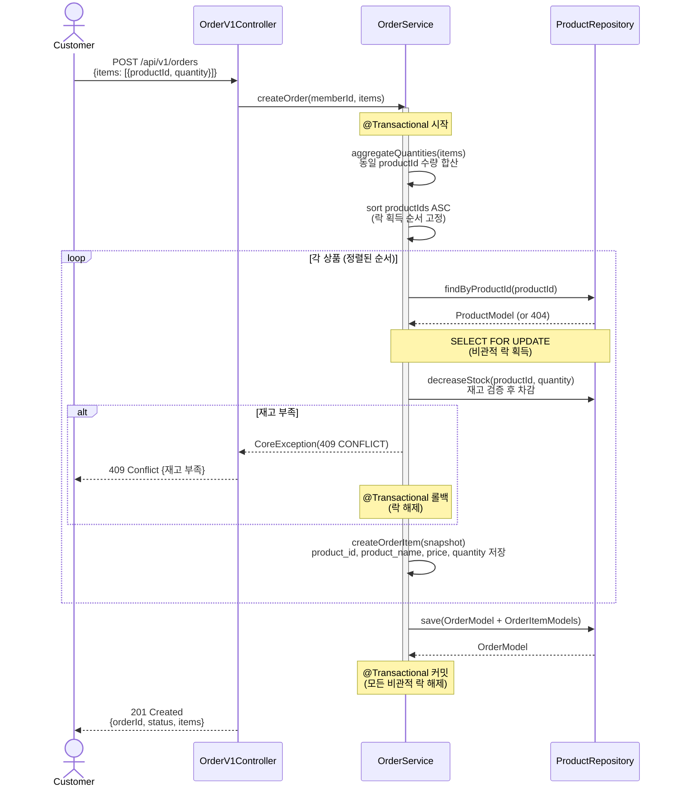
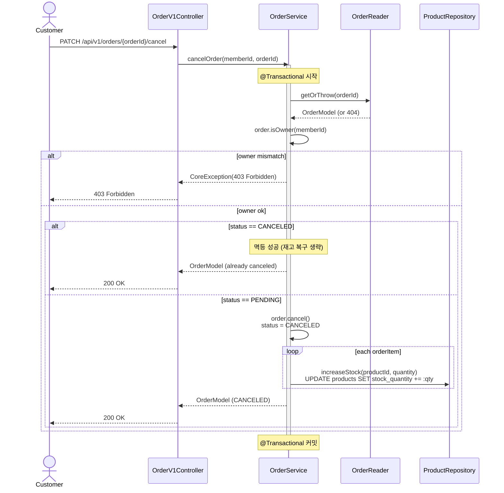
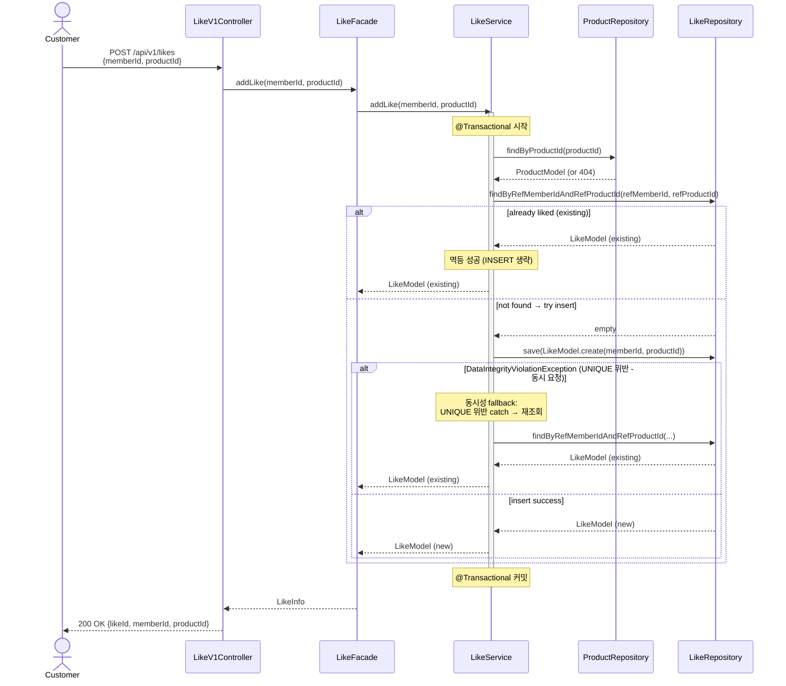
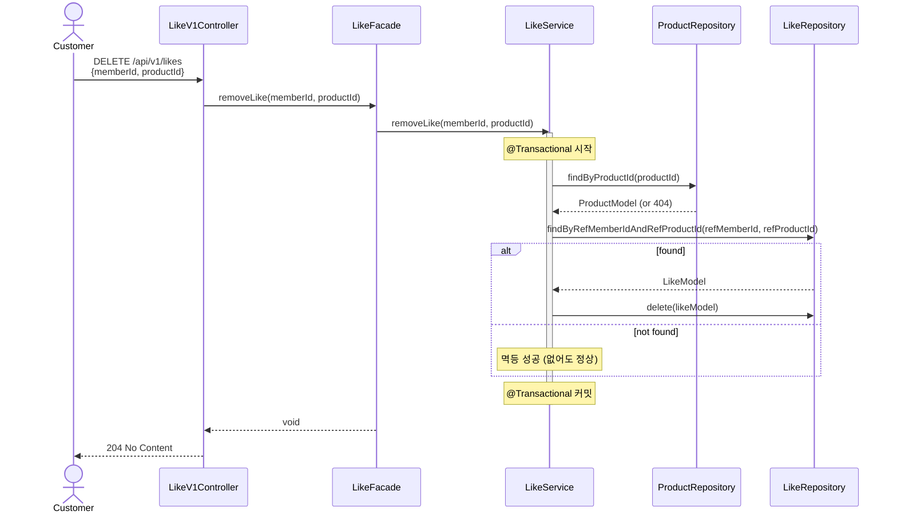
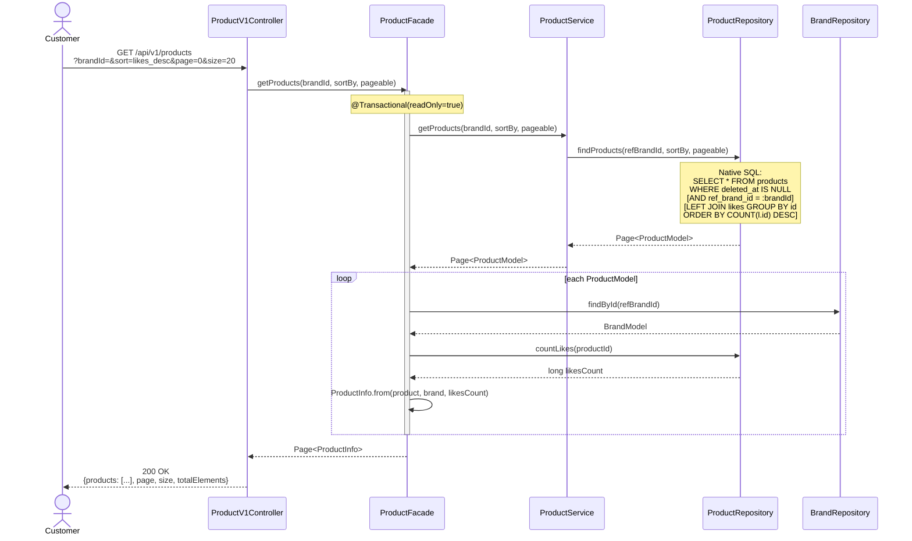

# 시퀀스 다이어그램

## 개요

이 문서는 주요 유스케이스의 시퀀스 다이어그램을 제공한다. 각 다이어그램은 **검증 목적 → 다이어그램 → 해석** 순서로 작성되며, 레이어드 아키텍처의 책임 경계와 트랜잭션 범위를 명확히 한다.

**레이어 구조**:
- **Interfaces Layer**: Controller
- **Application Layer**: Facade
- **Domain Layer**: Service, Reader, Model
- **Infrastructure Layer**: Repository(Impl), JpaRepository

**동시성 전략 요약**:
| 도메인 | 전략 | 근거 |
|--------|------|------|
| 재고 (stock) | 비관적 락 (`SELECT ... FOR UPDATE`) | 높은 경합, 과판매 절대 불가 |
| 좋아요 (like) | DB UNIQUE 제약 + 예외 catch | 낮은 경합, 중복 1건은 치명적이지 않음 |

---

## 1. 주문 생성 (POST /api/v1/orders)

### 검증 목적
주문 생성의 핵심은 **재고 차감의 동시성 제어**와 **스냅샷 저장의 트랜잭션 일관성**이다. 이 다이어그램은:
1. productId 정렬로 데드락을 방지하는 흐름
2. 비관적 락(`SELECT ... FOR UPDATE`)으로 재고를 안전하게 차감하는 방법
3. 주문/주문항목 저장과 재고 차감이 단일 트랜잭션으로 묶이는 경계
를 검증한다.

### 시퀀스 다이어그램

### 해석
- **트랜잭션 경계**: `OrderService@Transactional`이 재고 차감부터 주문 저장까지 묶는다. 재고 부족 시 전체 롤백.
- **비관적 락 전략**: `SELECT ... FOR UPDATE`로 행 잠금 → 재고 검증 → 차감. 조건부 UPDATE 방식보다 명시적이고 안전.
- **데드락 방지**: productId 오름차순 정렬로 모든 트랜잭션이 동일한 순서로 락을 획득하여 순환 대기 제거.
- **스냅샷 패턴**: OrderItemModel에 주문 시점의 product_id, product_name, price를 복사 저장. Product 삭제/수정 후에도 주문 이력 유지.
- **Facade 없음**: 주문 도메인은 OrderService가 직접 ProductRepository를 의존하여 재고 차감 + 주문 저장 오케스트레이션.

---

## 2. 주문 취소 (PATCH /api/v1/orders/{orderId}/cancel)

### 검증 목적
주문 취소는 **보상 트랜잭션(Compensating Transaction)** 패턴이다. 이 다이어그램은:
1. 상태 전이 검증(PENDING → CANCELED)
2. 재고 복구의 트랜잭션 일관성
3. 소유권(owner) 확인
을 검증한다.

### 시퀀스 다이어그램

### 해석
- **트랜잭션 경계**: 상태 전이와 재고 복구가 단일 트랜잭션으로 묶여, 부분 성공을 방지한다.
- **멱등성**: 이미 CANCELED 상태면 재고 복구 없이 200 OK 성공 처리 (중복 복구 방지).
- **책임 분리**: OrderReader는 orderId 기반 조회 + 404 처리, OrderService는 상태 전이 + 재고 복구 오케스트레이션.
- **소유권 확인**: `order.isOwner(memberId)`로 타 유저 접근 차단 (도메인 행위 메서드).
- **재고 복구**: 단순 증가 UPDATE (비관적 락 불필요 - 복구는 충돌 없음).

---

## 3. 좋아요 추가/취소 (POST/DELETE /api/v1/products/{productId}/likes)

### 검증 목적
좋아요는 **멱등성**과 **UNIQUE 제약 처리**가 핵심이다. 이 다이어그램은:
1. 추가 시 중복 처리 (UNIQUE 제약 catch → 기존 좋아요 반환)
2. 취소 시 없어도 성공 처리
3. 상품 존재 확인 흐름 (LikeService → ProductRepository)
을 검증한다.

### 시퀀스 다이어그램(좋아요 추가)

### 시퀀스 다이어그램(좋아요 취소)

### 해석
- **락 불필요**: 좋아요는 경합이 낮고, 중복 1건은 비즈니스적으로 치명적이지 않다. DB UNIQUE 제약이 최종 방어선.
- **멱등성**: 추가 시 선조회로 중복 확인, UNIQUE 위반 시 catch 후 재조회로 성공 처리. 취소 시 없어도 성공.
- **Reader 미사용**: LikeService가 ProductRepository를 직접 사용하여 상품 존재 확인 (Reader 패턴 제거됨).
- **Facade 역할**: LikeFacade는 LikeService를 위임 호출하고 LikeInfo로 변환하는 thin facade.

---

## 4. 상품 목록 조회 (GET /api/v1/products)

### 검증 목적
상품 목록 조회는 **soft delete 필터링**, **정렬 옵션**, **좋아요 수 집계**의 성능 트레이드오프를 보여준다. 이 다이어그램은:
1. deleted_at 필터가 항상 적용되는지
2. likes_desc 정렬 시 LEFT JOIN + COUNT 집계
3. Brand 정보와 좋아요 수 enrichment 흐름
을 검증한다.

### 시퀀스 다이어그램

### 해석
- **Soft Delete 필터**: 모든 쿼리에 `deleted_at IS NULL`이 포함되어 삭제된 상품을 제외.
- **정렬 옵션**:
  - **latest** (기본): `ORDER BY updated_at DESC`
  - **price_asc**: `ORDER BY price ASC`
  - **likes_desc**: `LEFT JOIN likes ON p.id = l.ref_product_id GROUP BY p.id ORDER BY COUNT(l.id) DESC`
- **Native Query 사용 이유**: VO 타입 (`ProductId`, `RefBrandId` 등)이 JPQL에서 처리 어려워 Native Query 사용.
- **Enrichment**: Facade에서 각 상품별 Brand 정보 + 좋아요 수를 추가로 조회하여 ProductInfo 구성 (N+1 주의 - 병목 시 단일 쿼리로 통합 고려).
- **성능 리스크**: likes_desc + COUNT는 상품/좋아요 수 증가 시 병목 가능 → 모니터링 후 Phase 2 (like_count 컬럼) 전환.

---

## 다이어그램 요약

| 유스케이스 | 핵심 검증 포인트 | 트랜잭션 범위 | 동시성 전략 |
|-----------|-----------------|--------------|------------|
| 주문 생성 | 재고 차감 동시성, 스냅샷 저장 | Service (@Transactional) | 비관적 락 + productId 정렬 |
| 주문 취소 | 상태 전이, 재고 복구, 멱등성 | Service (@Transactional) | 없음 (복구는 충돌 없음) |
| 좋아요 추가/취소 | UNIQUE 제약, 멱등성 | Service (@Transactional) | DB UNIQUE 제약 |
| 상품 목록 조회 | Soft Delete 필터, 정렬/집계 성능 | 없음 (읽기 전용) | 없음 |

---

## 다음 단계

이 시퀀스 다이어그램을 기반으로:
- **03-class-diagram.md**: 각 레이어의 클래스 책임과 의존성 방향 설계
- **04-erd.md**: 트랜잭션 경계와 동시성 제어를 지원하는 테이블 구조 설계
