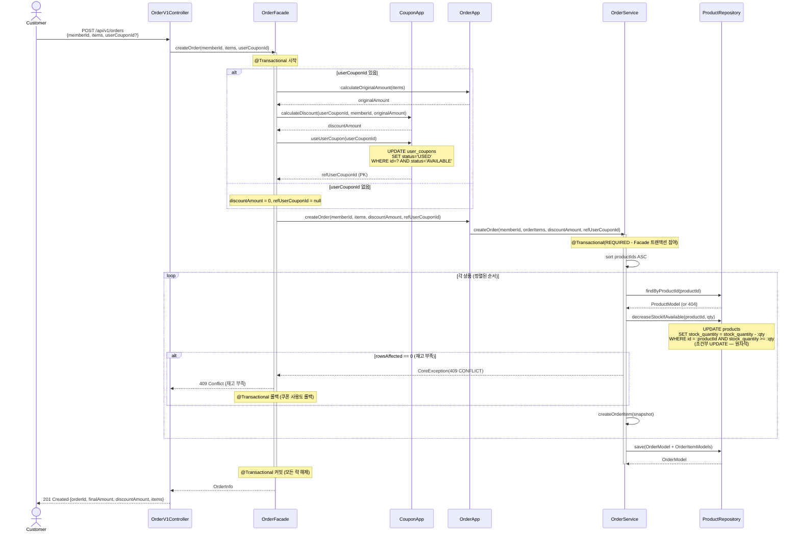
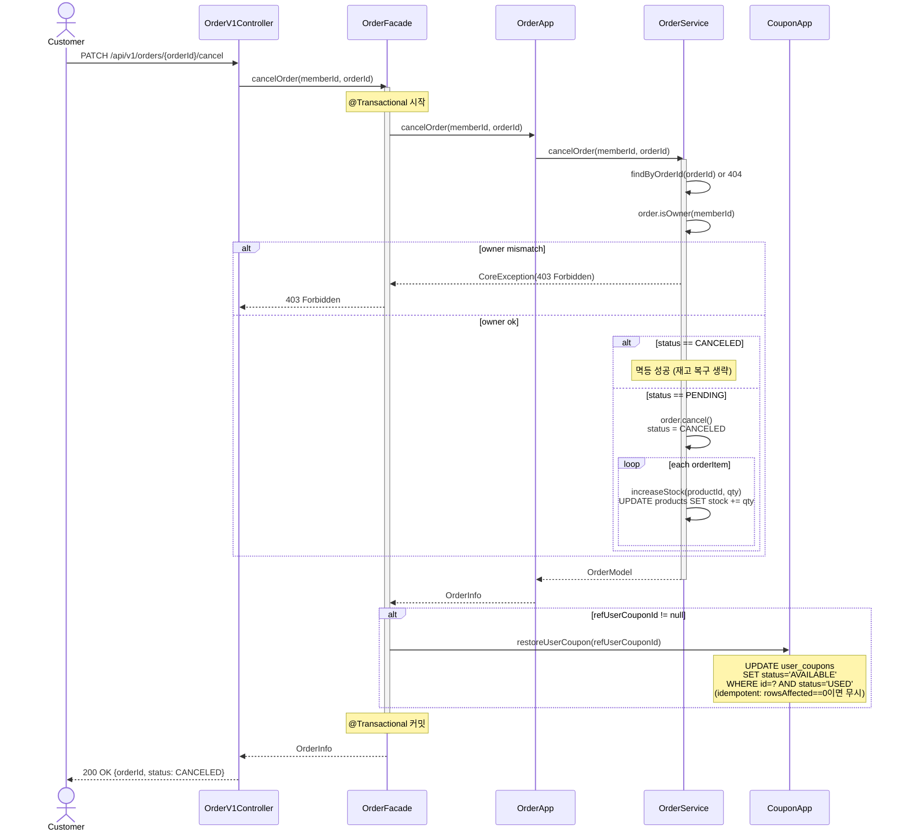
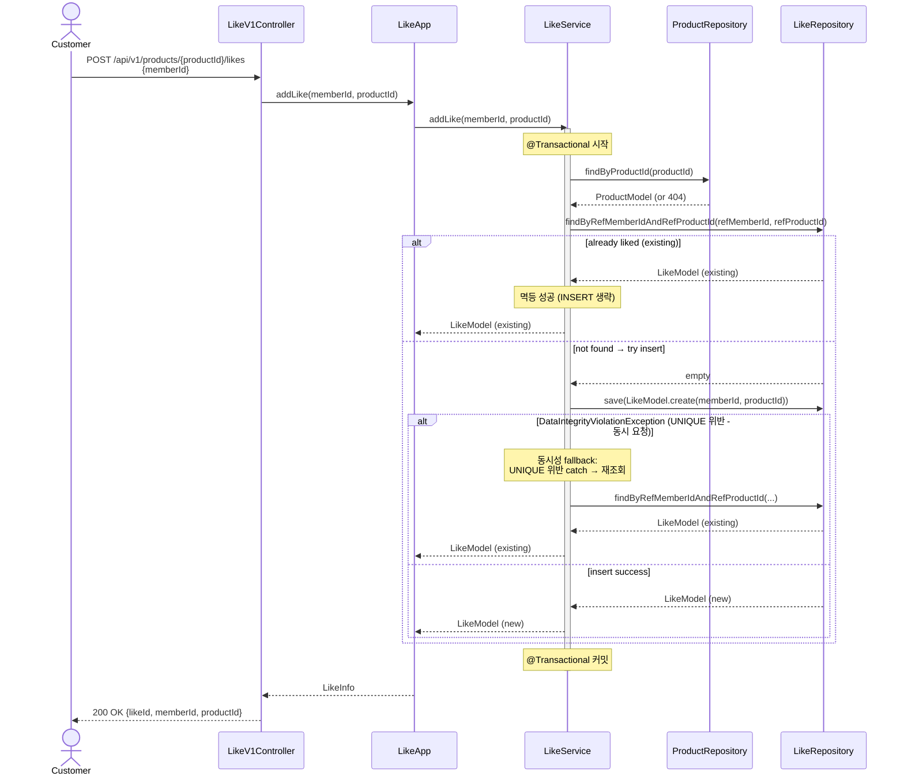
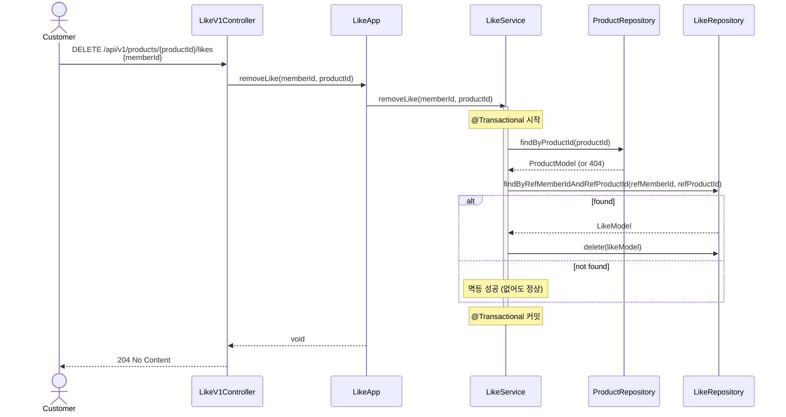
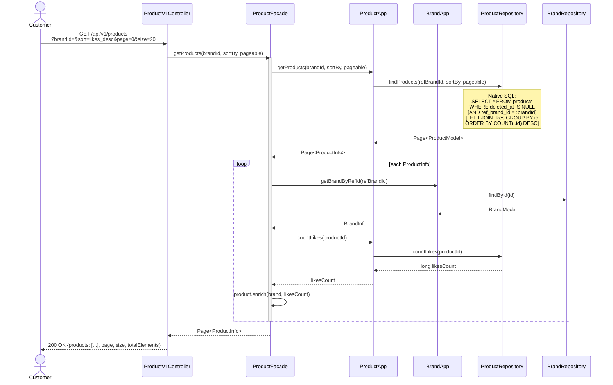
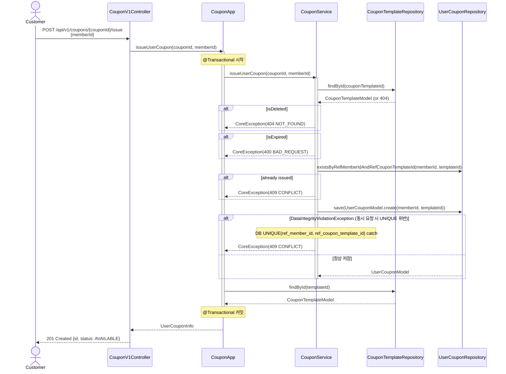

# 시퀀스 다이어그램

## 개요

이 문서는 주요 유스케이스의 시퀀스 다이어그램을 제공한다. 각 다이어그램은 **검증 목적 → 다이어그램 → 해석** 순서로 작성되며, 레이어드 아키텍처의 책임 경계와 트랜잭션 범위를 명확히 한다.

**레이어 구조**:
- **Interfaces Layer**: Controller
- **Application Layer**: App (단일 도메인), Facade (복수 App 조합)
- **Domain Layer**: Service, Model
- **Infrastructure Layer**: Repository(Impl), JpaRepository

**동시성 전략 요약**:
| 도메인 | 전략 | 근거 |
|--------|------|------|
| 재고 (stock) | 조건부 UPDATE + productId ASC 정렬 | 원자적 차감(`WHERE stock_quantity >= qty`), 정렬로 데드락 방지 |
| 쿠폰 발급 (coupon issue) | DB UNIQUE 제약 + 예외 catch | 수량 제한 없음, 중복 발급만 방지 |
| 쿠폰 사용 (coupon use) | 조건부 UPDATE (`WHERE status = 'AVAILABLE'`) | 상태 기반 원자적 변경, 락 없이 안전 |
| 좋아요 (like) | DB UNIQUE 제약 + 예외 catch | 낮은 경합, 중복 1건은 치명적이지 않음 |

---

## 1. 주문 생성 (POST /api/v1/orders)

### 검증 목적
주문 생성의 핵심은 **쿠폰 할인 적용**, **재고 차감의 동시성 제어**, **스냅샷 저장의 트랜잭션 일관성**이다. 이 다이어그램은:
1. OrderFacade가 CouponApp + OrderApp을 조합하는 크로스 도메인 오케스트레이션 흐름
2. 쿠폰 적용 시 할인 계산 → 쿠폰 사용 처리 → 주문 생성 순서 보장
3. productId 정렬로 데드락을 방지하는 흐름
4. 조건부 UPDATE(`WHERE stock_quantity >= qty`)로 재고를 원자적으로 차감하는 방법
을 검증한다.

### 시퀀스 다이어그램

```mermaid
sequenceDiagram
    actor Customer
    participant Controller as OrderV1Controller
    participant Facade as OrderFacade
    participant CouponApp as CouponApp
    participant OrderApp as OrderApp
    participant OrderService as OrderService
    participant ProductRepo as ProductRepository

    Customer->>Controller: POST /api/v1/orders<br/>{memberId, items, userCouponId?}
    Controller->>Facade: createOrder(memberId, items, userCouponId)

    activate Facade
    Note over Facade: @Transactional 시작

    alt userCouponId 있음
        %% 1. 원래 주문금액 계산 (재고 차감 전)
        Facade->>OrderApp: calculateOriginalAmount(items)
        OrderApp-->>Facade: originalAmount

        %% 2. 할인 금액 계산 (소유권 + 상태 + 최소금액 검증)
        Facade->>CouponApp: calculateDiscount(userCouponId, memberId, originalAmount)
        CouponApp-->>Facade: discountAmount

        %% 3. 쿠폰 사용 처리 (조건부 UPDATE → PK 반환)
        Facade->>CouponApp: useUserCoupon(userCouponId)
        Note over CouponApp: UPDATE user_coupons<br/>SET status='USED'<br/>WHERE id=? AND status='AVAILABLE'
        CouponApp-->>Facade: refUserCouponId (PK)
    else userCouponId 없음
        Note over Facade: discountAmount = 0, refUserCouponId = null
    end

    %% 4. 주문 생성 (재고 차감 + 스냅샷 저장)
    Facade->>OrderApp: createOrder(memberId, items, discountAmount, refUserCouponId)
    OrderApp->>OrderService: createOrder(memberId, orderItems, discountAmount, refUserCouponId)

    activate OrderService
    Note over OrderService: @Transactional(REQUIRED - Facade 트랜잭션 참여)

    %% productId 오름차순 정렬 (데드락 방지)
    OrderService->>OrderService: sort productIds ASC

    loop 각 상품 (정렬된 순서)
        OrderService->>ProductRepo: findByProductId(productId)
        ProductRepo-->>OrderService: ProductModel (or 404)

        OrderService->>ProductRepo: decreaseStockIfAvailable(productId, qty)
        Note over ProductRepo: UPDATE products<br/>SET stock_quantity = stock_quantity - :qty<br/>WHERE id = :productId AND stock_quantity >= :qty<br/>(조건부 UPDATE — 원자적)

        alt rowsAffected == 0 (재고 부족)
            OrderService-->>Facade: CoreException(409 CONFLICT)
            Facade-->>Controller: 409 Conflict {재고 부족}
            Note over Facade: @Transactional 롤백 (쿠폰 사용도 롤백)
        end

        OrderService->>OrderService: createOrderItem(snapshot)
    end

    OrderService->>ProductRepo: save(OrderModel + OrderItemModels)
    ProductRepo-->>OrderService: OrderModel

    deactivate OrderService

    Note over Facade: @Transactional 커밋 (모든 락 해제)
    deactivate Facade

    Facade-->>Controller: OrderInfo
    Controller-->>Customer: 201 Created {orderId, finalAmount, discountAmount, items}
```

### 해석
- **트랜잭션 경계**: `OrderFacade@Transactional`이 쿠폰 사용 처리부터 재고 차감·주문 저장까지 단일 트랜잭션으로 묶는다. 재고 부족 시 쿠폰 사용도 함께 롤백.
- **크로스 도메인 Facade**: 2개 이상의 App(CouponApp + OrderApp)을 조합하므로 Facade 사용. Controller → Facade → App 패턴 준수.
- **쿠폰 사용 전략**: 조건부 UPDATE(`WHERE status = 'AVAILABLE'`)로 락 없이 원자적 상태 변경. rowsAffected == 0 이면 이미 사용/불가 상태.
- **재고 조건부 UPDATE**: `decreaseStockIfAvailable`이 `WHERE stock_quantity >= qty` 조건으로 차감과 검증을 원자적으로 실행. productId 오름차순 정렬로 데드락 방지.
- **스냅샷 패턴**: OrderItemModel에 주문 시점의 product_id, product_name, price를 복사 저장.

---

## 2. 주문 취소 (PATCH /api/v1/orders/{orderId}/cancel)

### 검증 목적
주문 취소는 **보상 트랜잭션(Compensating Transaction)** 패턴이다. 이 다이어그램은:
1. 상태 전이 검증(PENDING → CANCELED)
2. 재고 복구의 트랜잭션 일관성
3. 소유권(owner) 확인
4. 쿠폰이 있었던 경우 쿠폰 복원 (idempotent)
을 검증한다.

### 시퀀스 다이어그램

```mermaid
sequenceDiagram
    actor Customer
    participant Controller as OrderV1Controller
    participant Facade as OrderFacade
    participant OrderApp as OrderApp
    participant OrderService as OrderService
    participant CouponApp as CouponApp

    Customer->>Controller: PATCH /api/v1/orders/{orderId}/cancel
    Controller->>Facade: cancelOrder(memberId, orderId)

    activate Facade
    Note over Facade: @Transactional 시작

    Facade->>OrderApp: cancelOrder(memberId, orderId)
    OrderApp->>OrderService: cancelOrder(memberId, orderId)

    activate OrderService
    %% 주문 조회
    OrderService->>OrderService: findByOrderId(orderId) or 404

    %% 소유권 확인
    OrderService->>OrderService: order.isOwner(memberId)
    alt owner mismatch
        OrderService-->>Facade: CoreException(403 Forbidden)
        Facade-->>Controller: 403 Forbidden
    else owner ok

        alt status == CANCELED
            Note over OrderService: 멱등 성공 (재고 복구 생략)
        else status == PENDING
            OrderService->>OrderService: order.cancel()<br/>status = CANCELED

            loop each orderItem
                OrderService->>OrderService: increaseStock(productId, qty)<br/>UPDATE products SET stock += qty
            end
        end

    end

    OrderService-->>OrderApp: OrderModel
    deactivate OrderService
    OrderApp-->>Facade: OrderInfo

    %% 쿠폰 복원 (주문에 쿠폰이 있었던 경우)
    alt refUserCouponId != null
        Facade->>CouponApp: restoreUserCoupon(refUserCouponId)
        Note over CouponApp: UPDATE user_coupons<br/>SET status='AVAILABLE'<br/>WHERE id=? AND status='USED'<br/>(idempotent: rowsAffected==0이면 무시)
    end

    Note over Facade: @Transactional 커밋
    deactivate Facade

    Facade-->>Controller: OrderInfo
    Controller-->>Customer: 200 OK {orderId, status: CANCELED}
```

### 해석
- **트랜잭션 경계**: 상태 전이, 재고 복구, 쿠폰 복원이 단일 트랜잭션으로 묶여 부분 성공을 방지한다.
- **멱등성**: 이미 CANCELED 상태면 재고·쿠폰 복구 없이 성공 처리 (중복 복구 방지). 쿠폰 복원도 조건부 UPDATE로 멱등 처리.
- **재고 복구**: 단순 증가 UPDATE (비관적 락 불필요 — 복구는 충돌 없음).
- **쿠폰 복원**: 조건부 UPDATE(`WHERE status = 'USED'`)로 이중 복원 방지.

---

## 3. 좋아요 추가/취소 (POST/DELETE /api/v1/products/{productId}/likes)

### 검증 목적
좋아요는 **멱등성**과 **UNIQUE 제약 처리**가 핵심이다. 이 다이어그램은:
1. 추가 시 중복 처리 (UNIQUE 제약 catch → 기존 좋아요 반환)
2. 취소 시 없어도 성공 처리
3. 상품 존재 확인 흐름 (LikeService → ProductRepository)
을 검증한다.

### 시퀀스 다이어그램(좋아요 추가)

```mermaid
sequenceDiagram
    actor Customer
    participant Controller as LikeV1Controller
    participant LikeApp as LikeApp
    participant LikeService as LikeService
    participant ProductRepo as ProductRepository
    participant LikeRepo as LikeRepository

    Customer->>Controller: POST /api/v1/products/{productId}/likes<br/>{memberId}
    Controller->>LikeApp: addLike(memberId, productId)
    LikeApp->>LikeService: addLike(memberId, productId)

    activate LikeService
    Note over LikeService: @Transactional 시작

    %% 상품 존재 확인 (ProductRepository 직접 사용)
    LikeService->>ProductRepo: findByProductId(productId)
    ProductRepo-->>LikeService: ProductModel (or 404)

    %% 중복 좋아요 확인 (멱등성 - 선조회)
    LikeService->>LikeRepo: findByRefMemberIdAndRefProductId(refMemberId, refProductId)

    alt already liked (existing)
        LikeRepo-->>LikeService: LikeModel (existing)
        Note over LikeService: 멱등 성공 (INSERT 생략)
        LikeService-->>LikeApp: LikeModel (existing)
    else not found → try insert
        LikeRepo-->>LikeService: empty
        LikeService->>LikeRepo: save(LikeModel.create(memberId, productId))

        alt DataIntegrityViolationException (UNIQUE 위반 - 동시 요청)
            Note over LikeService: 동시성 fallback:<br/>UNIQUE 위반 catch → 재조회
            LikeService->>LikeRepo: findByRefMemberIdAndRefProductId(...)
            LikeRepo-->>LikeService: LikeModel (existing)
            LikeService-->>LikeApp: LikeModel (existing)
        else insert success
            LikeRepo-->>LikeService: LikeModel (new)
            LikeService-->>LikeApp: LikeModel (new)
        end
    end

    Note over LikeService: @Transactional 커밋
    deactivate LikeService

    LikeApp-->>Controller: LikeInfo
    Controller-->>Customer: 200 OK {likeId, memberId, productId}
```

### 시퀀스 다이어그램(좋아요 취소)

```mermaid
sequenceDiagram
    actor Customer
    participant Controller as LikeV1Controller
    participant LikeApp as LikeApp
    participant LikeService as LikeService
    participant ProductRepo as ProductRepository
    participant LikeRepo as LikeRepository

    Customer->>Controller: DELETE /api/v1/products/{productId}/likes<br/>{memberId}
    Controller->>LikeApp: removeLike(memberId, productId)
    LikeApp->>LikeService: removeLike(memberId, productId)

    activate LikeService
    Note over LikeService: @Transactional 시작

    LikeService->>ProductRepo: findByProductId(productId)
    ProductRepo-->>LikeService: ProductModel (or 404)

    LikeService->>LikeRepo: findByRefMemberIdAndRefProductId(refMemberId, refProductId)
    alt found
        LikeRepo-->>LikeService: LikeModel
        LikeService->>LikeRepo: delete(likeModel)
    else not found
        Note over LikeService: 멱등 성공 (없어도 정상)
    end

    Note over LikeService: @Transactional 커밋
    deactivate LikeService

    LikeApp-->>Controller: void
    Controller-->>Customer: 204 No Content
```

### 해석
- **락 불필요**: 좋아요는 경합이 낮고, 중복 1건은 비즈니스적으로 치명적이지 않다. DB UNIQUE 제약이 최종 방어선.
- **멱등성**: 추가 시 선조회로 중복 확인, UNIQUE 위반 시 catch 후 재조회로 성공 처리. 취소 시 없어도 성공.
- **App 직접 사용**: 좋아요 추가/취소는 단일 도메인(LikeApp)이므로 Facade 없이 Controller → LikeApp 직접 호출.
- **LikeFacade 별도**: `내 좋아요 목록 조회(getMyLikedProducts)`는 LikeApp + ProductApp + BrandApp 조합이 필요하므로 LikeFacade 사용.

---

## 4. 상품 목록 조회 (GET /api/v1/products)

### 검증 목적
상품 목록 조회는 **soft delete 필터링**, **정렬 옵션**, **좋아요 수 집계**의 성능 트레이드오프를 보여준다. 이 다이어그램은:
1. deleted_at 필터가 항상 적용되는지
2. likes_desc 정렬 시 LEFT JOIN + COUNT 집계
3. Brand 정보와 좋아요 수 enrichment 흐름 (ProductFacade → ProductApp + BrandApp)
을 검증한다.

### 시퀀스 다이어그램

```mermaid
sequenceDiagram
    actor Customer
    participant Controller as ProductV1Controller
    participant ProductFacade as ProductFacade
    participant ProductApp as ProductApp
    participant BrandApp as BrandApp
    participant ProductRepo as ProductRepository
    participant BrandRepo as BrandRepository

    Customer->>Controller: GET /api/v1/products<br/>?brandId=&sort=likes_desc&page=0&size=20
    Controller->>ProductFacade: getProducts(brandId, sortBy, pageable)

    activate ProductFacade

    ProductFacade->>ProductApp: getProducts(brandId, sortBy, pageable)
    ProductApp->>ProductRepo: findProducts(refBrandId, sortBy, pageable)

    Note over ProductRepo: Native SQL:<br/>SELECT * FROM products<br/>WHERE deleted_at IS NULL<br/>[AND ref_brand_id = :brandId]<br/>[LEFT JOIN likes GROUP BY id<br/>ORDER BY COUNT(l.id) DESC]

    ProductRepo-->>ProductApp: Page<ProductModel>
    ProductApp-->>ProductFacade: Page<ProductInfo>

    %% enrichment (Brand 정보 + 좋아요 수)
    loop each ProductInfo
        ProductFacade->>BrandApp: getBrandByRefId(refBrandId)
        BrandApp->>BrandRepo: findById(id)
        BrandRepo-->>BrandApp: BrandModel
        BrandApp-->>ProductFacade: BrandInfo

        ProductFacade->>ProductApp: countLikes(productId)
        ProductApp->>ProductRepo: countLikes(productId)
        ProductRepo-->>ProductApp: long likesCount
        ProductApp-->>ProductFacade: likesCount

        ProductFacade->>ProductFacade: product.enrich(brand, likesCount)
    end

    deactivate ProductFacade

    ProductFacade-->>Controller: Page<ProductInfo>
    Controller-->>Customer: 200 OK {products: [...], page, size, totalElements}
```

### 해석
- **Facade Enrichment**: ProductFacade가 ProductApp(상품 조회+좋아요 수) + BrandApp(브랜드 조회)을 조합. 2개의 App을 사용하므로 Facade 사용 기준 충족.
- **Soft Delete 필터**: 모든 쿼리에 `deleted_at IS NULL`이 포함되어 삭제된 상품을 제외.
- **정렬 옵션**: latest (updated_at DESC), price_asc, likes_desc (LEFT JOIN + COUNT).
- **성능 리스크**: likes_desc + COUNT는 상품/좋아요 수 증가 시 병목 가능 → 모니터링 후 Phase 2 (like_count 컬럼) 전환.

---

## 5. 쿠폰 발급 (POST /api/v1/coupons/{couponId}/issue)

### 검증 목적
쿠폰 발급의 핵심은 **중복 발급 방지**이다. 이 다이어그램은:
1. 삭제/만료 검증 순서
2. 선조회로 중복 발급 1차 확인
3. DB UNIQUE 제약이 동시 요청 시 최종 방어선이 되는 흐름
을 검증한다.

### 시퀀스 다이어그램

```mermaid
sequenceDiagram
    actor Customer
    participant Controller as CouponV1Controller
    participant CouponApp as CouponApp
    participant CouponService as CouponService
    participant TemplateRepo as CouponTemplateRepository
    participant UserCouponRepo as UserCouponRepository

    Customer->>Controller: POST /api/v1/coupons/{couponId}/issue<br/>{memberId}
    Controller->>CouponApp: issueUserCoupon(couponId, memberId)

    activate CouponApp
    Note over CouponApp: @Transactional 시작

    CouponApp->>CouponService: issueUserCoupon(couponId, memberId)

    activate CouponService

    %% 일반 조회 (락 없음)
    CouponService->>TemplateRepo: findById(couponTemplateId)
    TemplateRepo-->>CouponService: CouponTemplateModel (or 404)

    %% 삭제 여부 확인
    alt isDeleted
        CouponService-->>CouponApp: CoreException(404 NOT_FOUND)
    end

    %% 만료 여부 확인
    alt isExpired
        CouponService-->>CouponApp: CoreException(400 BAD_REQUEST)
    end

    %% 중복 발급 선조회 확인
    CouponService->>UserCouponRepo: existsByRefMemberIdAndRefCouponTemplateId(memberId, templateId)
    alt already issued
        CouponService-->>CouponApp: CoreException(409 CONFLICT)
    end

    %% 발급 처리 (UNIQUE 제약이 최종 방어선)
    CouponService->>UserCouponRepo: save(UserCouponModel.create(memberId, templateId))

    alt DataIntegrityViolationException (동시 요청 시 UNIQUE 위반)
        Note over CouponService: DB UNIQUE(ref_member_id, ref_coupon_template_id) catch
        CouponService-->>CouponApp: CoreException(409 CONFLICT)
    else 정상 저장
        UserCouponRepo-->>CouponService: UserCouponModel
    end

    deactivate CouponService

    %% Info 변환을 위한 template 재조회 (expiredAt 필요)
    CouponApp->>TemplateRepo: findById(templateId)
    TemplateRepo-->>CouponApp: CouponTemplateModel

    Note over CouponApp: @Transactional 커밋
    deactivate CouponApp

    CouponApp-->>Controller: UserCouponInfo
    Controller-->>Customer: 201 Created {id, status: AVAILABLE}
```

### 해석
- **수량 제한 없음**: 쿠폰 템플릿에 totalQuantity/issuedQuantity 필드가 없다. 같은 쿠폰을 여러 명이 발급받을 수 있으나, 동일 사용자가 중복 발급받는 것만 방지한다.
- **DB UNIQUE 제약**: `uk_user_coupon_member_template(ref_member_id, ref_coupon_template_id)` — 동시 요청 시 중복 발급을 DB 레벨에서 최종 방어. 선조회는 1차 확인, UNIQUE 위반 catch가 2차 방어.
- **트랜잭션 경계**: `CouponApp@Transactional`이 검증 → 저장을 단일 트랜잭션으로 묶는다.

---

## 다이어그램 요약

| 유스케이스 | 레이어 진입점 | 트랜잭션 범위 | 동시성 전략 |
|-----------|-------------|--------------|------------|
| 주문 생성 | OrderFacade (쿠폰 있으면) / OrderApp (쿠폰 없으면) | Facade @Transactional | 재고: 조건부 UPDATE + productId 정렬 / 쿠폰: 조건부 UPDATE |
| 주문 취소 | OrderFacade | Facade @Transactional | 없음 (복구는 충돌 없음) / 쿠폰 복원: 조건부 UPDATE |
| 좋아요 추가/취소 | LikeApp | Service @Transactional | DB UNIQUE 제약 + catch |
| 상품 목록 조회 | ProductFacade | 없음 (읽기 전용) | 없음 |
| 쿠폰 발급 | CouponApp | App @Transactional | DB UNIQUE 제약 + catch |
| 쿠폰 사용 (주문 내) | OrderFacade → CouponApp | Facade @Transactional | 조건부 UPDATE |

---

## 다음 단계

이 시퀀스 다이어그램을 기반으로:
- **03-class-diagram.md**: 각 레이어의 클래스 책임과 의존성 방향 설계
- **04-erd.md**: 트랜잭션 경계와 동시성 제어를 지원하는 테이블 구조 설계