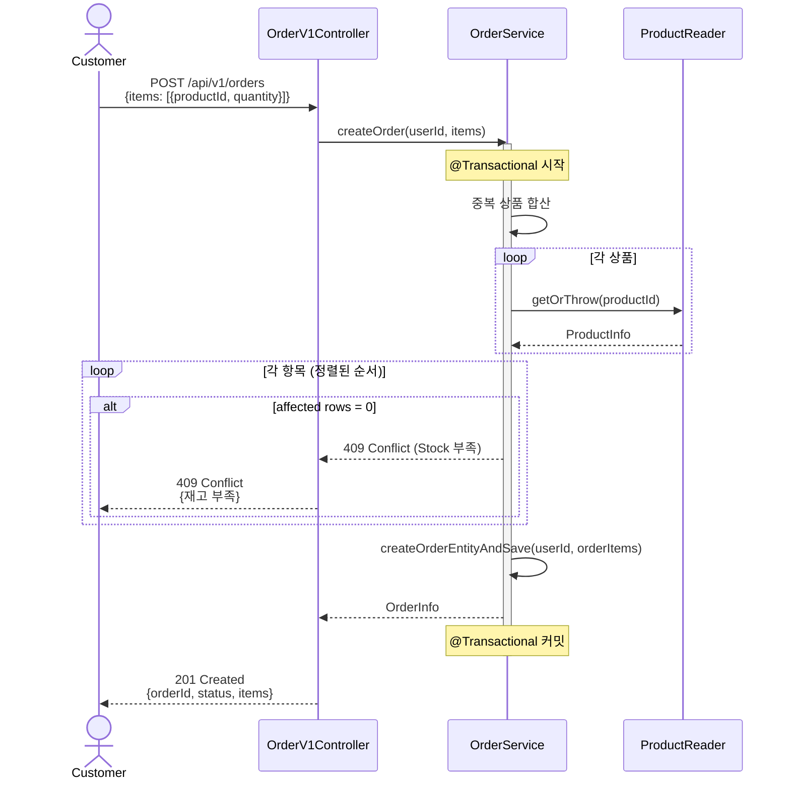
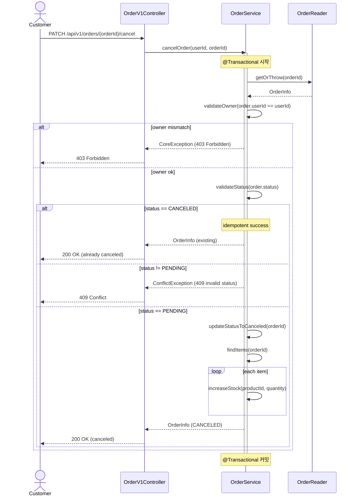
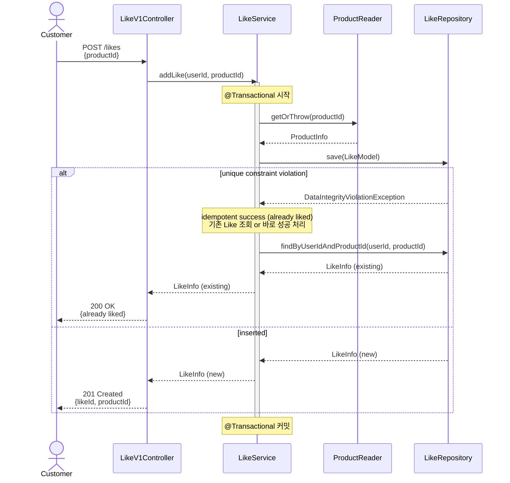
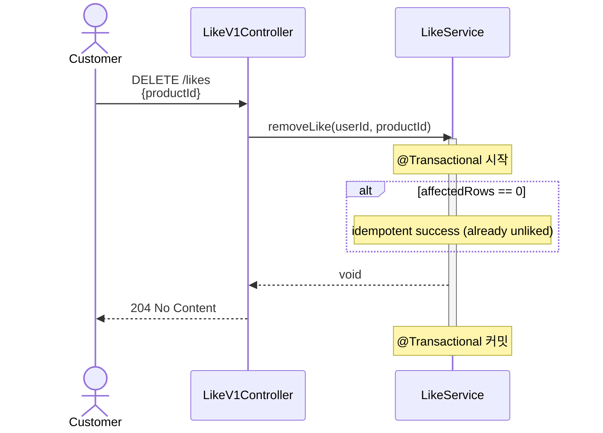
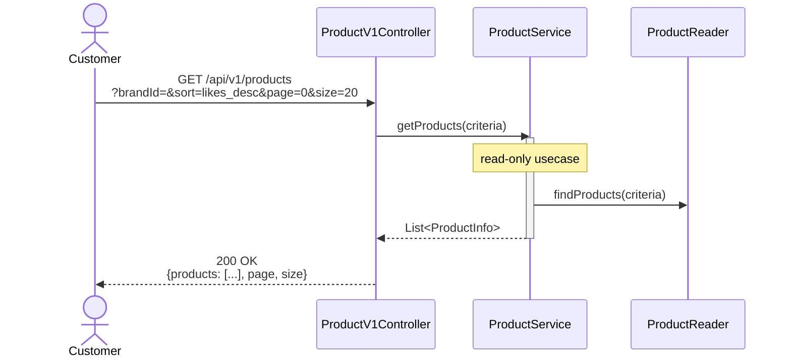

# 시퀀스 다이어그램

## 개요

이 문서는 주요 유스케이스의 시퀀스 다이어그램을 제공한다. 각 다이어그램은 **검증 목적 → 다이어그램 → 해석** 순서로 작성되며, 레이어드 아키텍처의 책임 경계와 트랜잭션 범위를 명확히 한다.

**레이어 구조**:
- **Interfaces Layer**: Controller
- **Domain Layer**: Service, Reader, Model
- **Infrastructure Layer**: Repository, JpaRepository

---

## 1. 주문 생성 (POST /api/v1/orders)

### 검증 목적
주문 생성의 핵심은 **재고 차감의 동시성 제어**와 **스냅샷 저장의 트랜잭션 일관성**이다. 이 다이어그램은:
1. productId 정렬로 데드락을 방지하는 흐름
2. 조건부 원자 UPDATE로 재고 부족을 안전하게 감지하는 방법
3. 주문/주문항목 저장과 재고 차감이 단일 트랜잭션으로 묶이는 경계
를 검증한다.

### 시퀀스 다이어그램

### 해석
- **트랜잭션 경계**: Service의 `@Transactional`이 재고 차감부터 주문 저장까지 묶는다. 재고 부족 시 전체 롤백된다.
- **동시성 제어**: `UPDATE ... WHERE stock_qty >= ?`로 조건부 원자 업데이트를 수행하며, productId 정렬로 데드락을 완화한다.
- **책임 분리**: ProductReader는 조회만, ProductRepository는 재고 차감, OrderService는 주문 로직과 스냅샷 저장을 담당한다.
- **실패 지점**: 재고 부족 시 affected rows=0 감지 후 즉시 예외를 던지고 트랜잭션이 롤백된다.

---

## 2. 주문 취소 (PATCH /api/v1/orders/{orderId}/cancel)

### 검증 목적
주문 취소는 **보상 트랜잭션(Compensating Transaction)** 패턴이다. 이 다이어그램은:
1. 상태 전이 검증(PENDING → CANCELED)
2. 재고 복구의 트랜잭션 일관성
3. 소유권(owner) 확인
을 검증한다.

### 시퀀스 다이어그램

### 해석
- **트랜잭션 경계**: 상태 전이와 재고 복구가 단일 트랜잭션으로 묶여, 부분 성공을 방지한다.
- **멱등성**: 이미 CANCELED 상태면 200 OK로 성공 처리 (재고 복구 중복 실행 방지).
- **책임 분리**: OrderReader는 조회+검증, OrderService는 상태 전이+재고 복구 오케스트레이션.
- **소유권 확인**: Service에서 userId 일치 여부를 확인하여 타 유저 접근을 차단한다.

---

## 3. 좋아요 추가/취소 (POST/DELETE /api/v1/products/{productId}/likes)

### 검증 목적
좋아요는 **멱등성**과 **UNIQUE 제약 처리**가 핵심이다. 이 다이어그램은:
1. 추가 시 중복 처리 (UNIQUE 제약 catch)
2. 취소 시 없어도 성공 처리
3. 상품 존재 확인 흐름
을 검증한다.

### 시퀀스 다이어그램(좋아요 추가)

### 시퀀스 다이어그램(좋아요 취소)

### 해석
- **멱등성**: 추가 시 UNIQUE 제약 위반을 catch하여 성공 처리, 취소 시 affected rows=0이어도 성공.
- **책임 분리**: ProductReader는 상품 존재 확인만, LikeService는 좋아요 추가/삭제 로직 담당.
- **간결한 트랜잭션**: 좋아요는 단순 CUD이므로 트랜잭션이 짧고 명확하다.
- **예외 처리**: 상품이 삭제되었거나 존재하지 않으면 404 Not Found (ProductReader.getOrThrow).

---

## 4. 상품 목록 조회 (GET /api/v1/products)

### 검증 목적
상품 목록 조회는 **soft delete 필터링**, **정렬 옵션**, **좋아요 수 집계**의 성능 트레이드오프를 보여준다. 이 다이어그램은:
1. deleted_at 필터가 항상 적용되는지
2. likes_desc 정렬 시 COUNT 집계 또는 like_count 컬럼 사용
3. 페이징 적용 흐름
을 검증한다.

### 시퀀스 다이어그램

### 해석
- **Soft Delete 필터**: 모든 쿼리에 `deleted_at IS NULL`이 포함되어 삭제된 상품을 제외한다.
- **정렬 옵션**:
  - **Phase 1 (likes_desc)**: COUNT 서브쿼리로 실시간 집계 (정확, 느릴 수 있음)
  - **Phase 2 (likes_desc)**: `like_count` 컬럼 사용 (빠름, 약한 일관성)
  - **latest**: `updated_at DESC`
  - **price_asc**: `price ASC`
- **페이징**: `LIMIT`, `OFFSET` 적용으로 성능 보장.
- **책임 분리**: ProductReader는 조회 조건 조합, ProductRepository는 쿼리 실행, Controller는 DTO 변환.
- **성능 리스크**: likes_desc + COUNT는 상품/좋아요 수 증가 시 병목 가능 → 모니터링 후 Phase 2로 전환.

---

## 다이어그램 요약

| 유스케이스 | 핵심 검증 포인트 | 트랜잭션 범위                  |
|-----------|-----------------|--------------------------|
| 주문 생성 | 재고 차감 동시성, 스냅샷 저장 | Service (@Transactional) |
| 주문 취소 | 상태 전이, 재고 복구, 멱등성 | Service (@Transactional)  |
| 좋아요 추가/취소 | UNIQUE 제약, 멱등성 | Service (@Transactional)  |
| 상품 목록 조회 | Soft Delete 필터, 정렬/집계 성능 | 없음 (읽기 전용)               |

---

## 다음 단계

이 시퀀스 다이어그램을 기반으로:
- **03-class-diagram.md**: 각 레이어의 클래스 책임과 의존성 방향 설계
- **04-erd.md**: 트랜잭션 경계와 동시성 제어를 지원하는 테이블 구조 설계
