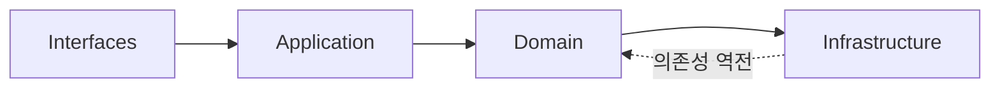
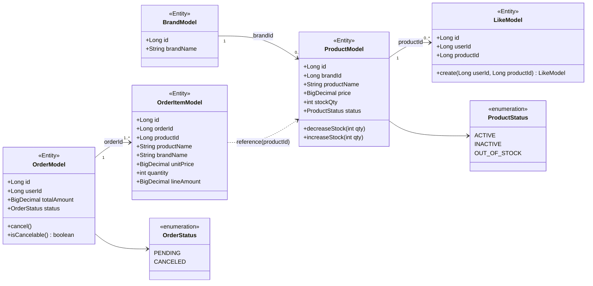
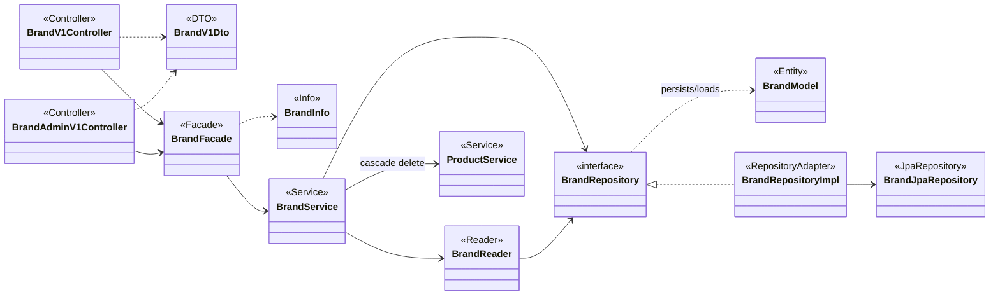
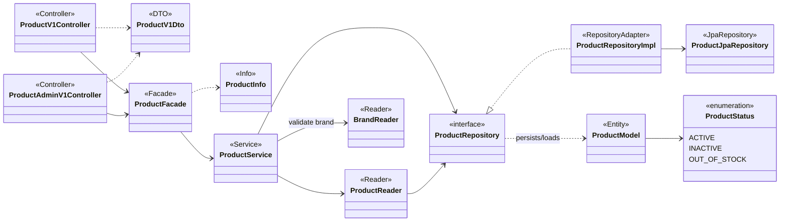
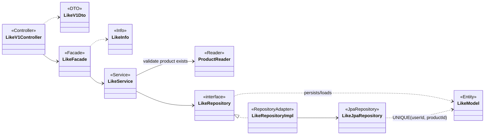
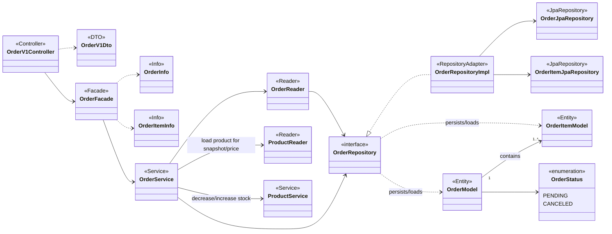
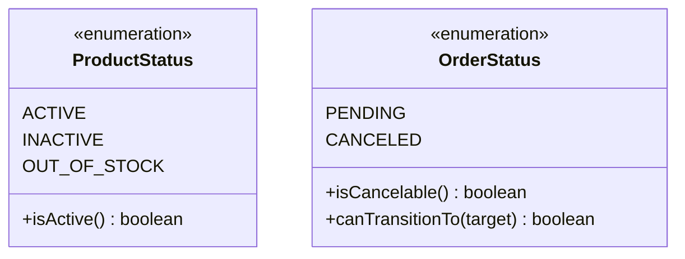
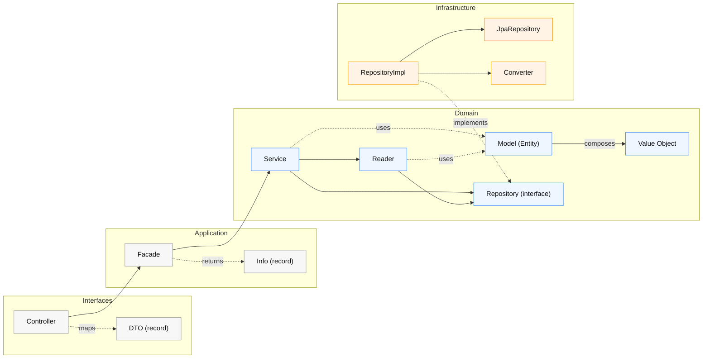

# 클래스 다이어그램

## 개요

이 문서는 레이어드 아키텍처에 따른 도메인 모델과 각 레이어의 책임을 정의한다. 클래스 다이어그램은 **의존성 방향**, **책임 경계**, **불변 규칙**을 중심으로 작성되며, 과도한 필드 객체화를 지양하고 실제 비즈니스 규칙이 있는 Value Object만 도입한다.

**레이어 의존성 규칙**:

---

## 레이어별 책임 요약

| 레이어 | 구성 요소 | 책임 |
|--------|----------|------|
| **Interfaces** | Controller, Dto | HTTP 요청/응답 처리, DTO 변환 |
| **Application** | Facade, Info | 유스케이스 조합, 도메인 서비스 오케스트레이션 |
| **Domain** | Model, Service, Reader, VO, Repository(interface) | 핵심 비즈니스 규칙, 상태 변화, 조회 로직 |
| **Infrastructure** | RepositoryImpl, JpaRepository, Converter | 기술 구현, 영속화, VO 변환 |

---

## 도메인 모델 전체 구조

### 검증 목적
전체 도메인 모델의 **관계**와 **의존성 방향**을 파악한다. Brand-Product, User-Like-Product, User-Order-OrderItem 관계가 명확히 드러나야 하며, 각 도메인이 다른 도메인의 **구현 세부사항에 의존하지 않는지** 확인한다.

### 다이어그램

### 해석
- **Brand-Product**: 1:N 관계이지만, ProductModel은 brandId(Long)만 보유하고 BrandModel 객체를 직접 참조하지 않는다 (느슨한 결합).
- **User-Like-Product**: LikeModel은 userId, productId만 보유 (User 도메인은 이번 범위 밖).
- **Order-OrderItem**: 1:N 강한 연관. OrderModel이 OrderItemModel을 Aggregate Root로 관리.
- **OrderItem-Product**: OrderItemModel은 productId를 참조하되, 스냅샷(productName, brandName, unitPrice 등)을 저장하여 Product 삭제에 독립적.
- **Soft Delete**: 모든 Model에 deletedAt 필드 존재 (BrandModel, ProductModel).

---

## 도메인별 상세 클래스 설계

### 1. Brand 도메인

#### 검증 목적
Brand 도메인은 **soft delete 연쇄**와 **단순 CRUD** 책임을 가진다. Facade에서 Brand 삭제 시 Product도 함께 soft delete 처리하는 오케스트레이션을 확인한다.

#### 다이어그램

#### 해석
- **Facade 책임**: 브랜드 삭제 시 ProductService를 호출하여 연쇄 soft delete 처리 (도메인 간 조합).
- **Reader vs Service**: BrandReader는 조회 전용, BrandService는 CUD 담당.
- **의존성 역전**: Domain의 BrandRepository(interface)를 Infrastructure의 BrandRepositoryImpl이 구현.

---

### 2. Product 도메인

#### 검증 목적
Product 도메인은 **재고 차감/복구**, **soft delete**, **Brand 참조** 책임을 가진다. ProductModel의 `decreaseStock`, `increaseStock` 메서드가 도메인 행위를 표현하는지 확인한다.

#### 다이어그램

#### 해석
- **재고 도메인 행위**: `decreaseStock`, `increaseStock`은 ProductModel의 도메인 메서드이지만, 동시성 제어를 위해 Repository에서 조건부 UPDATE 실행.
- **Brand 참조**: ProductService가 BrandReader를 의존하여 브랜드 존재 확인 (brandId 검증).
- **연쇄 삭제**: ProductFacade의 `softDeleteByBrandId`는 BrandFacade에서 호출됨.
- **정렬/집계**: ProductRepository의 findAll에서 likes_desc 정렬 시 COUNT 서브쿼리 또는 like_count 컬럼 사용.

---

### 3. Like 도메인

#### 검증 목적
Like 도메인은 **멱등성**과 **UNIQUE 제약** 처리를 확인한다. LikeService에서 중복 처리 로직이 명확한지 검증한다.

#### 다이어그램

#### 해석
- **멱등 처리**: LikeService의 `addLike`에서 UNIQUE 제약 위반 시 catch하여 성공 처리, `removeLike`는 affected rows=0이어도 성공.
- **Facade 책임**: ProductReader를 호출하여 상품 존재 확인 (삭제된 상품에 좋아요 방지).
- **간결한 도메인**: LikeModel은 단순 CUD만 수행, 복잡한 비즈니스 규칙 없음.

---

### 4. Order 도메인

#### 검증 목적
Order 도메인은 **재고 차감**, **스냅샷 저장**, **주문 취소** 책임을 가진다. OrderFacade가 ProductService, OrderService를 조합하여 트랜잭션을 관리하는지 확인한다.

#### 다이어그램

#### 해석
- **Facade 트랜잭션 조합**:
  - 주문 생성: ProductReader(상품 조회) → ProductService(재고 차감) → OrderService(주문+스냅샷 저장)
  - 주문 취소: OrderReader(주문 조회) → OrderService(상태 전이) → ProductService(재고 복구)
- **스냅샷**: OrderItemModel이 productName, brandName 등을 저장하여 Product 삭제에 독립적.
- **상태 전이**: OrderModel의 `cancel()` 메서드가 상태 검증 후 CANCELED로 전이.
- **Aggregate Root**: OrderModel이 OrderItemModel을 소유 (1:N 강한 연관).

---

## Value Object 설계

### 검증 목적
이 프로젝트에서는 **간단한 원시 타입은 VO로 만들지 않는다**. 대신 **검증 규칙이나 연산이 필요한 경우에만** VO를 도입한다. 현재 설계에서는 ProductStatus, OrderStatus만 enum으로 정의하고, 나머지(price, stockQty 등)는 원시 타입 사용.

#### 다이어그램

#### 해석
- **ProductStatus**: 상품 상태 관리 (활성/비활성/품절). 확장 가능 (추후 SOLD_OUT 등 추가).
- **OrderStatus**: 주문 상태 전이 검증 메서드 제공 (`isCancelable`, `canTransitionTo`).
- **VO 미도입 대상**: price (BigDecimal), stockQty (Integer), userId (Long) 등은 별도 검증 규칙 없이 원시 타입 사용.

---

## 레이어별 의존성 흐름

### 검증 목적
의존성 방향이 **Interfaces → Application → Domain ← Infrastructure** 를 따르는지 확인한다. Domain이 Infrastructure를 직접 의존하지 않고, Repository interface를 통해 의존성 역전이 되는지 검증한다.

### 다이어그램

### 해석
- **의존성 역전**: Domain의 Repository(interface)를 Infrastructure의 RepositoryImpl이 구현 (점선).
- **DTO 변환**: Controller에서 Dto → Info 변환, Facade에서 Info → Dto 변환 (레이어 간 격리).
- **도메인 독립성**: Domain Layer는 Infrastructure를 직접 의존하지 않음 (Spring, JPA 무관).

---

## 주요 설계 원칙

### 1. 레이어 책임 분리
- **Controller**: HTTP 프로토콜, DTO 변환, 인증 헤더 추출
- **Facade**: 유스케이스 조합, 트랜잭션 경계 (@Transactional)
- **Service**: 도메인 규칙 실행, 교차 엔티티 로직
- **Reader**: 조회 전용, VO 변환, getOrThrow 패턴
- **Repository**: 영속화, 쿼리 실행

### 2. 도메인 모델 설계
- **정적 팩토리**: `create()` 메서드로 생성 (생성자 private)
- **도메인 행위**: `cancel()`, `decreaseStock()` 등 도메인 메서드 제공
- **검증 로직**: private 메서드로 캡슐화 (`validateStockSufficient`)

### 3. Value Object 최소화
- **원칙**: 검증/연산 규칙이 없으면 원시 타입 사용
- **VO 도입 기준**: 불변 + 검증 규칙 + 의미 있는 연산
- **현재 VO**: ProductStatus, OrderStatus (enum)

### 4. 의존성 역전
- Domain이 Infrastructure를 의존하지 않음
- Repository interface를 Domain에 두고, Infrastructure에서 구현

---

## 다음 단계

이 클래스 다이어그램을 기반으로:
- **04-erd.md**: 각 Model의 테이블 구조, UNIQUE 제약, FK, 인덱스 설계
