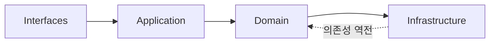
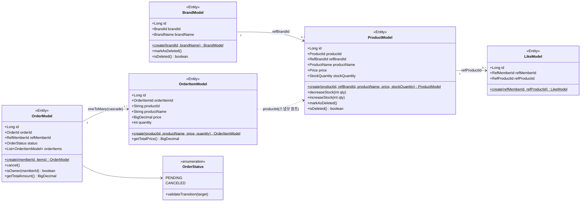
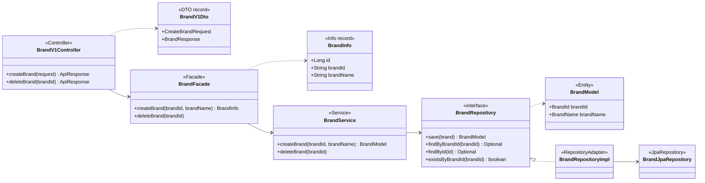
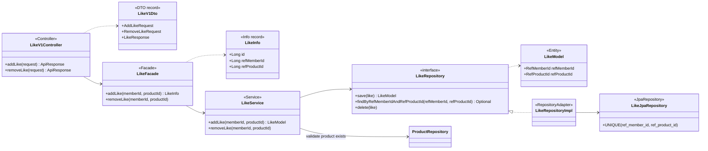
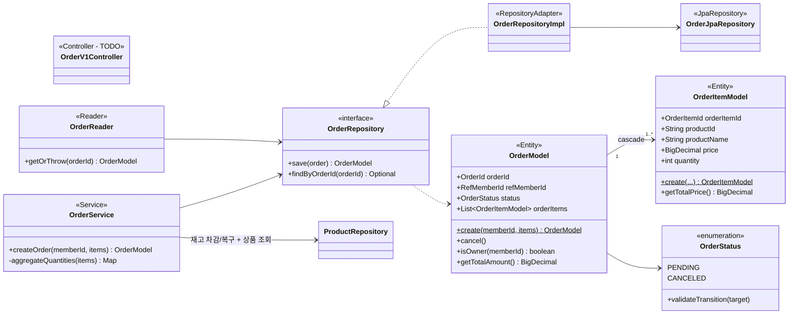
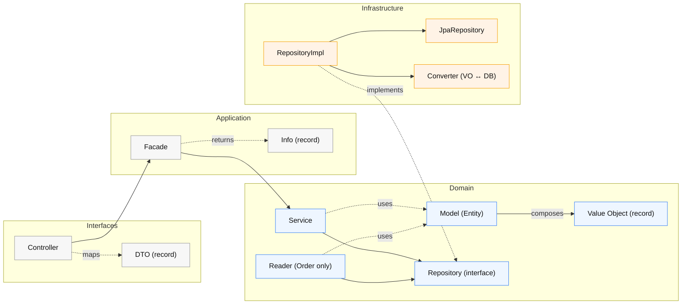

```mermaid
classDiagram
    direction LR

%% Interfaces
    class ProductV1Controller {
        <<Controller>>
        +createProduct(request) ApiResponse
        +getProducts(brandId, sort, page, size) ApiResponse
        +deleteProduct(productId) ApiResponse
    }
    class ProductV1Dto {
        <<DTO record>>
        +CreateProductRequest
        +ProductResponse
        +ProductListResponse
    }

%% Application
    class ProductFacade {
        <<Facade>>
        +createProduct(...) ProductInfo
        +deleteProduct(productId)
        +getProducts(brandId, sortBy, pageable) Page~ProductInfo~
        -enrichProductInfo(product) ProductInfo
    }
    class ProductInfo {
        <<Info record>>
        +Long id
        +String productId
        +Long refBrandId
        +String productName
        +BigDecimal price
        +int stockQuantity
        +BrandInfo brand
        +long likesCount
    }

%% Domain
    class ProductService {
        <<Service>>
        +createProduct(productId, brandId, productName, price, stockQuantity) ProductModel
        +deleteProduct(productId)
        +getProducts(brandId, sortBy, pageable) Page~ProductModel~
    }
    class ProductRepository {
        <<interface>>
        +save(product) ProductModel
        +findByProductId(productId) Optional
        +existsByProductId(productId) boolean
        +findProducts(refBrandId, sortBy, pageable) Page
        +decreaseStockIfAvailable(productId, quantity) boolean
        +increaseStock(productId, quantity)
        +countLikes(productId) long
    }
    class ProductModel {
        <<Entity>>
    }

%% Infrastructure
    class ProductRepositoryImpl {
        <<RepositoryAdapter>>
        -EntityManager entityManager
        +findProducts() Native SQL
        +decreaseStockIfAvailable() Native SQL UPDATE
        +increaseStock() Native SQL UPDATE
        +countLikes() Native SQL COUNT
    }
    class ProductJpaRepository {
        <<JpaRepository>>
    }

%% Relationships
    ProductV1Controller --> ProductFacade
    ProductV1Controller ..> ProductV1Dto
    ProductFacade --> ProductService
    ProductFacade --> ProductRepository : countLikes
    ProductFacade --> BrandRepository : enrichment
    ProductFacade ..> ProductInfo
    ProductService --> ProductRepository
    ProductService --> BrandRepository : validate brand exists
    ProductRepository <|.. ProductRepositoryImpl
    ProductRepositoryImpl --> ProductJpaRepository
    ProductRepository ..> ProductModel
```

```mermaid
classDiagram
    class ProductId {
        <<record>>
        +String value
        %% ^[A-Za-z0-9]{1,20}$
    }
    class ProductName {
        <<record>>
        +String value
        %% 1-100자
    }
    class Price {
        <<record>>
        +BigDecimal value
        %% >= 0, scale=2
    }
    class StockQuantity {
        <<record>>
        +int value
        %% >= 0
    }
    class RefBrandId {
        <<record>>
        +Long value
        %% > 0
    }
    class BrandId {
        <<record>>
        +String value
        %% ^[A-Za-z0-9]{1,10}$
    }
    class BrandName {
        <<record>>
        +String value
        %% 1-50자
    }
    class OrderId {
        <<record>>
        +String value
        +generate() OrderId$
        %% UUID 형식
    }
    class OrderItemId {
        <<record>>
        +String value
        +generate() OrderItemId$
        %% UUID 형식
    }
    class RefMemberId {
        <<record>>
        +Long value
        %% > 0
    }
    class RefProductId {
        <<record>>
        +Long value
        %% > 0
    }
    class OrderStatus {
        <<enumeration>>
        PENDING
        CANCELED
        +validateTransition(target)
    }
```

# 클래스 다이어그램

## 개요

이 문서는 레이어드 아키텍처에 따른 도메인 모델과 각 레이어의 책임을 정의한다. 클래스 다이어그램은 **의존성 방향**, **책임 경계**, **불변 규칙**을 중심으로 작성되며, **실제 코드 구현**을 기반으로 한다.

**레이어 의존성 규칙**:

---

## 레이어별 책임 요약

| 레이어 | 구성 요소 | 책임 |
|--------|----------|------|
| **Interfaces** | Controller, Dto, ApiSpec | HTTP 요청/응답 처리, DTO 변환 |
| **Application** | Facade, Info | 유스케이스 조합, 도메인 서비스 오케스트레이션, Info 변환 |
| **Domain** | Model, Service, Reader(Order만), VO, Repository(interface) | 핵심 비즈니스 규칙, 상태 변화, 트랜잭션 관리 |
| **Infrastructure** | RepositoryImpl, JpaRepository, Converter | 기술 구현, 영속화, VO ↔ DB 변환 |

---

## 도메인 모델 전체 구조

### 검증 목적
전체 도메인 모델의 **관계**와 **의존성 방향**을 파악한다. Brand-Product, Member-Like-Product, Member-Order-OrderItem 관계가 명확히 드러나야 하며, 각 도메인이 다른 도메인의 **구현 세부사항에 의존하지 않는지** 확인한다.

### 다이어그램

### 해석
- **Brand-Product**: 1:N 관계. ProductModel은 `refBrandId(Long)`만 보유하고 BrandModel 객체를 직접 참조하지 않는다 (느슨한 결합).
- **Like**: Member-Product 간 독립 도메인. `refMemberId(Long)`, `refProductId(Long)`로 간접 참조.
- **Order-OrderItem**: 1:N 강한 연관 (cascade). OrderModel이 Aggregate Root로 OrderItemModel을 관리.
- **OrderItem 스냅샷**: productId, productName, price를 저장 시점의 값으로 복사. Product 삭제/수정 후에도 주문 이력 유지.
- **Soft Delete**: BrandModel, ProductModel에 deletedAt 필드 존재 (BaseEntity 상속). LikeModel, OrderModel은 hard delete 또는 삭제 없음.

---

## 도메인별 상세 클래스 설계

### 1. Brand 도메인

#### 검증 목적
Brand 도메인은 **soft delete**와 **단순 CRUD** 책임을 가진다. BrandService가 브랜드 생성/삭제를 담당하며, BrandFacade가 Controller와 Service를 연결한다.

#### 다이어그램

#### 해석
- **Reader 미사용**: BrandService가 BrandRepository를 직접 사용. Reader 패턴은 Order 도메인에서만 유지.
- **Thin Facade**: BrandFacade는 BrandService를 위임 호출하고 BrandInfo로 변환.
- **의존성 역전**: Domain의 BrandRepository(interface)를 Infrastructure의 BrandRepositoryImpl이 구현.

---

### 2. Product 도메인

#### 검증 목적
Product 도메인은 **재고 차감/복구**, **soft delete**, **Brand 참조**, **좋아요 수 집계** 책임을 가진다. ProductFacade가 Brand 정보와 좋아요 수를 enrichment하는 흐름을 확인한다.

#### 다이어그램

#### 해석
- **Facade Enrichment**: ProductFacade가 ProductModel → ProductInfo 변환 시, BrandRepository와 ProductRepository(countLikes)를 추가 조회하여 Brand 정보와 좋아요 수를 enrichment.
- **Reader 미사용**: ProductService가 ProductRepository를 직접 사용.
- **Native Query**: VO 타입(ProductId, RefBrandId 등)이 JPQL과 호환 어려워 EntityManager + Native SQL 사용.
- **재고 동시성**: `decreaseStockIfAvailable`는 비관적 락 기반으로 구현 예정 (`SELECT FOR UPDATE`).

---

### 3. Like 도메인

#### 검증 목적
Like 도메인은 **멱등성**과 **UNIQUE 제약** 처리를 확인한다. LikeService가 ProductRepository를 직접 사용하여 상품 존재 확인을 하는지 검증한다.

#### 다이어그램

#### 해석
- **ProductRepository 직접 사용**: LikeService가 Reader 없이 ProductRepository를 직접 의존하여 상품 존재 확인.
- **UNIQUE 제약**: `uk_likes_member_product(ref_member_id, ref_product_id)` - DB 레벨 중복 방지.
- **멱등 처리**: 선조회로 중복 확인 → INSERT 시도 → DataIntegrityViolationException catch → 재조회 반환.

---

### 4. Order 도메인

#### 검증 목적
Order 도메인은 **재고 차감(비관적 락)**, **스냅샷 저장**, **주문 취소** 책임을 가진다. OrderService가 ProductRepository를 직접 사용하여 재고 차감 + 주문 저장을 오케스트레이션하는지 확인한다.

#### 다이어그램

#### 해석
- **Facade 미구현**: Order 도메인은 아직 Facade 없이 OrderService가 직접 ProductRepository와 OrderRepository를 사용.
- **OrderReader 유지**: orderId 기반 조회 + 404 처리를 담당하는 Reader는 Order 도메인에만 존재.
- **재고 차감 책임**: OrderService가 ProductRepository.decreaseStockIfAvailable()를 호출하여 재고 차감.
- **OrderItem은 별도 JpaRepository 없음**: OrderModel에 cascade ALL 설정으로 OrderJpaRepository가 order_items도 함께 관리.

---

## Value Object 설계

### 검증 목적
이 프로젝트에서 VO는 **검증 규칙이 있는 원시값을 캡슐화**한다. `record` 타입의 Compact Constructor에서 검증을 수행하여, 잘못된 상태가 생성 시점에 차단된다.

#### 다이어그램

#### 해석
- **record 타입**: 불변 + Compact Constructor 검증으로 잘못된 값 생성 차단.
- **Converter 패턴**: 각 VO에 대응하는 JPA Converter가 DB 저장/조회 시 원시타입 ↔ VO 변환.
- **FK 참조 VO**: `RefBrandId(Long)`, `RefMemberId(Long)`, `RefProductId(Long)` - 외래키를 VO로 래핑.
- **UUID VO**: `OrderId`, `OrderItemId` - UUID 기반으로 정적 `generate()` 메서드 제공.
- **OrderStatus**: 상태 전이 검증 메서드(`validateTransition`) 포함.

---

## 레이어별 의존성 흐름

### 검증 목적
의존성 방향이 **Interfaces → Application → Domain ← Infrastructure** 를 따르는지 확인한다. Domain이 Infrastructure를 직접 의존하지 않고, Repository interface를 통해 의존성 역전이 되는지 검증한다.

### 다이어그램

### 해석
- **Reader 패턴**: Brand/Product 도메인에서는 제거됨. Order 도메인에만 OrderReader 유지 (orderId 기반 조회 특화).
- **의존성 역전**: Domain의 Repository(interface) ← Infrastructure의 RepositoryImpl이 구현 (점선).
- **Converter**: VO ↔ DB 원시타입 변환 담당. EntityManager Native Query 사용 시 VO 타입 제약 우회.
- **도메인 독립성**: Domain Layer는 Spring, JPA 기술을 직접 알지 않음 (단, JPA Entity 어노테이션은 예외).

---

## 주요 설계 원칙

### 1. 레이어 책임 분리
- **Controller**: HTTP 프로토콜, DTO 변환, 인증 헤더 추출
- **Facade**: 유스케이스 조합, Model → Info 변환, Thin Facade (로직 없음)
- **Service**: 도메인 규칙 실행, @Transactional 경계, Repository 호출
- **Reader**: orderId 기반 조회 + orElseThrow (Order 도메인 한정)
- **Repository**: 영속화, 쿼리 실행 (Domain interface → Infrastructure 구현)

### 2. 도메인 모델 설계
- **정적 팩토리**: `create()` 메서드로 생성 (생성자 private/protected)
- **도메인 행위**: `cancel()`, `decreaseStock()`, `isOwner()` 등 도메인 메서드 제공
- **불변 VO**: record 타입, Compact Constructor 검증, Converter로 DB 연동

### 3. 동시성 제어
- **재고**: 비관적 락 (`SELECT ... FOR UPDATE`) - 경합 높음, 과판매 불가
- **좋아요**: DB UNIQUE 제약 + catch - 경합 낮음, 중복 1건 허용 범위

### 4. 의존성 역전
- Domain이 Infrastructure를 의존하지 않음
- Repository interface를 Domain에 두고, Infrastructure에서 구현
