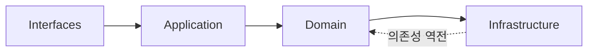
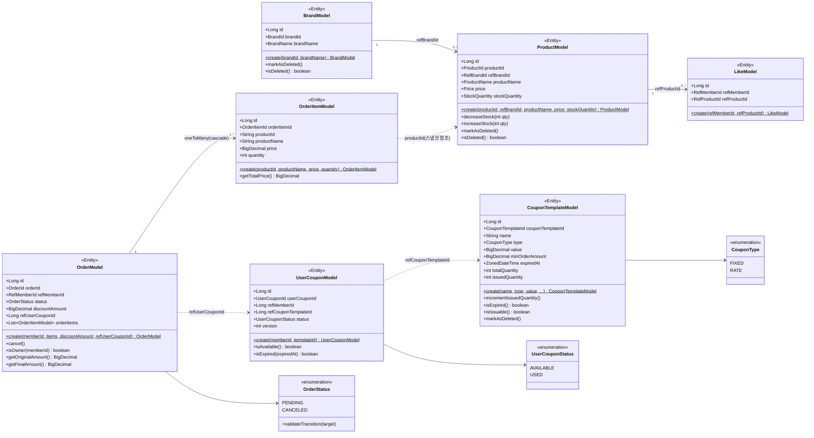
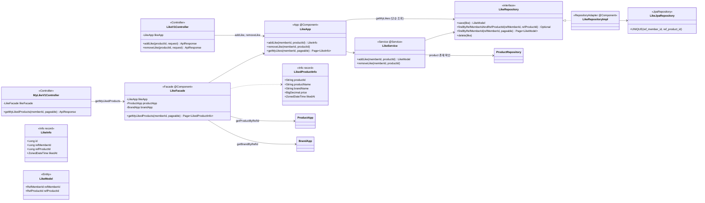

# 클래스 다이어그램

## 개요

이 문서는 레이어드 아키텍처에 따른 도메인 모델과 각 레이어의 책임을 정의한다. 클래스 다이어그램은 **의존성 방향**, **책임 경계**, **불변 규칙**을 중심으로 작성되며, **실제 코드 구현**을 기반으로 한다.

**레이어 의존성 규칙**:

```mermaid
flowchart LR
    I[Interfaces] --> A[Application]
    A --> D[Domain]
    D --> B[Infrastructure]
    B -. "의존성 역전" .-> D
```

---

## 레이어별 책임 요약

| 레이어 | 구성 요소 | 책임 |
|--------|----------|------|
| **Interfaces** | Controller, Dto, ApiSpec | HTTP 요청/응답 처리, DTO 변환 |
| **Application** | App (단일 도메인), Facade (복수 App 조합), Info | 유스케이스 조합, 도메인 서비스 오케스트레이션, Info 변환 |
| **Domain** | Model, Service, VO, Repository(interface) | 핵심 비즈니스 규칙, 상태 변화, 트랜잭션 관리 |
| **Infrastructure** | RepositoryImpl, JpaRepository, Converter | 기술 구현, 영속화, VO ↔ DB 변환 |

**App vs Facade 사용 기준**:
- **App** (`@Component`): 단일 도메인 유스케이스. Controller가 직접 호출. Model → Info 변환 담당.
- **Facade** (`@Component`): **2개 이상의 App을 조합**할 때만 생성. Controller → Facade → App(복수).

---

## 도메인 모델 전체 구조

### 검증 목적
전체 도메인 모델의 **관계**와 **의존성 방향**을 파악한다. Brand-Product, Member-Like-Product, Member-Order-OrderItem, Member/Order-Coupon 관계가 명확히 드러나야 하며, 각 도메인이 다른 도메인의 **구현 세부사항에 의존하지 않는지** 확인한다.

### 다이어그램

```mermaid
classDiagram
    direction LR

    class BrandModel {
        <<Entity>>
        +Long id
        +BrandId brandId
        +BrandName brandName
        +create(brandId, brandName) BrandModel$
        +markAsDeleted()
        +isDeleted() boolean
    }

    class ProductModel {
        <<Entity>>
        +Long id
        +ProductId productId
        +RefBrandId refBrandId
        +ProductName productName
        +Price price
        +StockQuantity stockQuantity
        +create(productId, refBrandId, productName, price, stockQuantity) ProductModel$
        +decreaseStock(int qty)
        +increaseStock(int qty)
        +markAsDeleted()
        +isDeleted() boolean
    }

    class LikeModel {
        <<Entity>>
        +Long id
        +RefMemberId refMemberId
        +RefProductId refProductId
        +create(refMemberId, refProductId) LikeModel$
    }

    class OrderModel {
        <<Entity>>
        +Long id
        +OrderId orderId
        +RefMemberId refMemberId
        +OrderStatus status
        +BigDecimal discountAmount
        +Long refUserCouponId
        +List~OrderItemModel~ orderItems
        +create(memberId, items, discountAmount, refUserCouponId) OrderModel$
        +cancel()
        +isOwner(memberId) boolean
        +getOriginalAmount() BigDecimal
        +getFinalAmount() BigDecimal
    }

    class OrderItemModel {
        <<Entity>>
        +Long id
        +OrderItemId orderItemId
        +String productId
        +String productName
        +BigDecimal price
        +int quantity
        +create(productId, productName, price, quantity) OrderItemModel$
        +getTotalPrice() BigDecimal
    }

    class CouponTemplateModel {
        <<Entity>>
        +Long id
        +CouponTemplateId couponTemplateId
        +String name
        +CouponType type
        +BigDecimal value
        +BigDecimal minOrderAmount
        +ZonedDateTime expiredAt
        +int totalQuantity
        +int issuedQuantity
        +create(name, type, value, ...) CouponTemplateModel$
        +incrementIssuedQuantity()
        +isExpired() boolean
        +isIssuable() boolean
        +markAsDeleted()
    }

    class UserCouponModel {
        <<Entity>>
        +Long id
        +UserCouponId userCouponId
        +Long refMemberId
        +Long refCouponTemplateId
        +UserCouponStatus status
        +int version
        +create(memberId, templateId) UserCouponModel$
        +isAvailable() boolean
        +isExpired(expiredAt) boolean
    }

    class OrderStatus {
        <<enumeration>>
        PENDING
        CANCELED
        +validateTransition(target)
    }

    class CouponType {
        <<enumeration>>
        FIXED
        RATE
    }

    class UserCouponStatus {
        <<enumeration>>
        AVAILABLE
        USED
    }

    BrandModel "1" --> "0..*" ProductModel : refBrandId
    ProductModel "1" --> "0..*" LikeModel : refProductId
    OrderModel "1" --> "1..*" OrderItemModel : oneToMany(cascade)
    OrderItemModel ..> ProductModel : productId(스냅샷 참조)
    OrderModel --> OrderStatus
    OrderModel ..> UserCouponModel : refUserCouponId
    CouponTemplateModel --> CouponType
    UserCouponModel --> UserCouponStatus
    UserCouponModel ..> CouponTemplateModel : refCouponTemplateId
```

### 해석
- **Brand-Product**: 1:N 관계. ProductModel은 `refBrandId(Long)`만 보유하고 BrandModel 객체를 직접 참조하지 않는다 (느슨한 결합).
- **Like**: Member-Product 간 독립 도메인. `refMemberId(Long)`, `refProductId(Long)`로 간접 참조.
- **Order-OrderItem**: 1:N 강한 연관 (cascade). OrderModel이 Aggregate Root로 OrderItemModel을 관리.
- **OrderItem 스냅샷**: productId, productName, price를 저장 시점의 값으로 복사. Product 삭제/수정 후에도 주문 이력 유지.
- **Order-Coupon**: OrderModel이 `refUserCouponId(Long)`만 보유하여 쿠폰 사용 이력 추적.
- **UserCouponModel `@Version`**: 낙관적 락 버전 컬럼 보유 (조건부 UPDATE와 함께 사용).
- **Soft Delete**: BrandModel, ProductModel, CouponTemplateModel에 deletedAt 필드 존재 (BaseEntity 상속).

---

## 도메인별 상세 클래스 설계

### 1. Brand 도메인

#### 검증 목적
Brand 도메인은 **soft delete**와 **단순 CRUD** 책임을 가진다. BrandApp이 브랜드 CRUD를 담당하고, BrandFacade가 브랜드 삭제 + 연관 상품 cascade delete를 오케스트레이션한다.

#### 다이어그램

```mermaid
classDiagram
    direction LR

%% Interfaces
    class BrandV1Controller {
        <<Controller>>
        -BrandApp brandApp
        -BrandFacade brandFacade
        +getBrand(brandId) ApiResponse
        +createBrand(request) ApiResponse
        +deleteBrand(brandId) ApiResponse
    }
    class BrandV1Dto {
        <<DTO record>>
        +CreateBrandRequest
        +BrandResponse
    }

%% Application
    class BrandApp {
        <<App @Component>>
        +createBrand(brandId, brandName) BrandInfo
        +getBrand(brandId) BrandInfo
        +deleteBrand(brandId) BrandInfo
        +getBrandByRefId(id) BrandInfo
    }
    class BrandFacade {
        <<Facade @Component>>
        -BrandApp brandApp
        -ProductApp productApp
        +deleteBrand(brandId) void
    }
    class BrandInfo {
        <<Info record>>
        +Long id
        +String brandId
        +String brandName
    }

%% Domain
    class BrandService {
        <<Service @Service>>
        +createBrand(brandId, brandName) BrandModel
        +deleteBrand(brandId) BrandModel
    }
    class BrandRepository {
        <<interface>>
        +save(brand) BrandModel
        +findByBrandId(brandId) Optional
        +findById(id) Optional
        +existsByBrandId(brandId) boolean
    }
    class BrandModel {
        <<Entity>>
        +BrandId brandId
        +BrandName brandName
    }

%% Infrastructure
    class BrandRepositoryImpl {
        <<RepositoryAdapter @Component>>
    }
    class BrandJpaRepository {
        <<JpaRepository>>
    }

%% Relationships
    BrandV1Controller --> BrandApp : CRUD (create, get)
    BrandV1Controller --> BrandFacade : deleteBrand (cascade)
    BrandV1Controller ..> BrandV1Dto
    BrandFacade --> BrandApp
    BrandFacade --> ProductApp : deleteProductsByBrandRefId
    BrandApp --> BrandService
    BrandApp --> BrandRepository : 단순 조회
    BrandApp ..> BrandInfo
    BrandService --> BrandRepository
    BrandRepository <|.. BrandRepositoryImpl
    BrandRepositoryImpl --> BrandJpaRepository
    BrandRepository ..> BrandModel
```

#### 해석
- **BrandFacade 역할**: BrandApp.deleteBrand() + ProductApp.deleteProductsByBrandRefId() 조합. 2개의 App을 사용하므로 Facade 기준 충족.
- **BrandApp 단순 조회**: getBrand(), getBrandByRefId()는 비즈니스 로직 없으므로 App에서 BrandRepository 직접 호출.
- **의존성 역전**: Domain의 BrandRepository(interface)를 Infrastructure의 BrandRepositoryImpl이 구현.

---

### 2. Product 도메인

#### 검증 목적
Product 도메인은 **재고 차감/복구**, **soft delete**, **Brand 참조**, **좋아요 수 집계** 책임을 가진다. ProductFacade가 ProductApp + BrandApp을 조합하여 enrichment하는 흐름을 확인한다.

#### 다이어그램

```mermaid
classDiagram
    direction LR

%% Interfaces
    class ProductV1Controller {
        <<Controller>>
        -ProductFacade productFacade
        +getProducts(brandId, sort, page) ApiResponse
        +getProduct(productId) ApiResponse
    }
    class ProductAdminV1Controller {
        <<Controller>>
        -ProductFacade productFacade
        +createProduct(request) ApiResponse
        +updateProduct(request) ApiResponse
        +deleteProduct(productId) ApiResponse
    }

%% Application
    class ProductApp {
        <<App @Component>>
        +createProduct(...) ProductInfo
        +getProduct(productId) ProductInfo
        +updateProduct(...) ProductInfo
        +deleteProduct(productId)
        +getProducts(brandId, sortBy, pageable) Page~ProductInfo~
        +getProductByRefId(id) ProductInfo
        +countLikes(productId) long
        +deleteProductsByBrandRefId(brandId)
    }
    class ProductFacade {
        <<Facade @Component>>
        -ProductApp productApp
        -BrandApp brandApp
        +createProduct(...) ProductInfo
        +getProduct(productId) ProductInfo
        +updateProduct(...) ProductInfo
        +deleteProduct(productId)
        +getProducts(brandId, sortBy, pageable) Page~ProductInfo~
        -enrichProductInfo(product) ProductInfo
    }
    class ProductInfo {
        <<Info record>>
        +Long id
        +String productId
        +Long refBrandId
        +String productName
        +BigDecimal price
        +int stockQuantity
        +BrandInfo brand
        +long likesCount
        +enrich(brand, likesCount) ProductInfo
    }

%% Domain
    class ProductService {
        <<Service @Service>>
        +createProduct(...) ProductModel
        +updateProduct(...) ProductModel
        +deleteProduct(productId)
        +deleteProductsByBrandRefId(brandId)
        +getProducts(brandId, sortBy, pageable) Page~ProductModel~
    }
    class ProductRepository {
        <<interface>>
        +save(product) ProductModel
        +findByProductId(productId) Optional
        +findById(id) Optional
        +findProducts(refBrandId, sortBy, pageable) Page
        +decreaseStockIfAvailable(productId, qty) int
        +increaseStock(productId, qty)
        +countLikes(productId) long
        +softDeleteByRefBrandId(brandId)
    }

%% Infrastructure
    class ProductRepositoryImpl {
        <<RepositoryAdapter @Component>>
        +findProducts() Native SQL
        +decreaseStockIfAvailable() @Modifying @Query
        +increaseStock() @Modifying @Query
        +countLikes() Native SQL COUNT
    }
    class ProductJpaRepository {
        <<JpaRepository>>
    }

%% Relationships
    ProductV1Controller --> ProductFacade
    ProductAdminV1Controller --> ProductFacade
    ProductFacade --> ProductApp
    ProductFacade --> BrandApp : enrichment
    ProductApp --> ProductService
    ProductApp --> ProductRepository : 단순 조회
    ProductService --> ProductRepository
    ProductService --> BrandRepository : brand 존재 확인
    ProductRepository <|.. ProductRepositoryImpl
    ProductRepositoryImpl --> ProductJpaRepository
```

#### 해석
- **ProductFacade 역할**: ProductApp + BrandApp 조합. enrich 시 BrandApp.getBrandByRefId() + ProductApp.countLikes() 호출.
- **재고 동시성**: `decreaseStockIfAvailable`은 `@Modifying @Query`로 조건부 UPDATE. OrderService 내에서 비관적 락 후 호출.
- **Native Query**: VO 타입(ProductId, RefBrandId 등)이 JPQL에서 처리 어려워 Native Query 사용.

---

### 3. Like 도메인

#### 검증 목적
Like 도메인은 **멱등성**과 **UNIQUE 제약** 처리를 확인한다. LikeApp이 단순 추가/취소를 담당하고, LikeFacade가 내 좋아요 목록 enrichment(LikeApp + ProductApp + BrandApp)를 조합한다.

#### 다이어그램

```mermaid
classDiagram
    direction LR

%% Interfaces
    class LikeV1Controller {
        <<Controller>>
        -LikeApp likeApp
        +addLike(productId, request) ApiResponse
        +removeLike(productId, request) ApiResponse
    }
    class MyLikeV1Controller {
        <<Controller>>
        -LikeFacade likeFacade
        +getMyLikedProducts(memberId, pageable) ApiResponse
    }

%% Application
    class LikeApp {
        <<App @Component>>
        +addLike(memberId, productId) LikeInfo
        +removeLike(memberId, productId)
        +getMyLikes(memberId, pageable) Page~LikeInfo~
    }
    class LikeFacade {
        <<Facade @Component>>
        -LikeApp likeApp
        -ProductApp productApp
        -BrandApp brandApp
        +getMyLikedProducts(memberId, pageable) Page~LikedProductInfo~
    }
    class LikeInfo {
        <<Info record>>
        +Long id
        +Long refMemberId
        +Long refProductId
        +ZonedDateTime likedAt
    }
    class LikedProductInfo {
        <<Info record>>
        +String productId
        +String productName
        +String brandName
        +BigDecimal price
        +ZonedDateTime likedAt
    }

%% Domain
    class LikeService {
        <<Service @Service>>
        +addLike(memberId, productId) LikeModel
        +removeLike(memberId, productId)
    }
    class LikeRepository {
        <<interface>>
        +save(like) LikeModel
        +findByRefMemberIdAndRefProductId(refMemberId, refProductId) Optional
        +findByRefMemberId(refMemberId, pageable) Page~LikeModel~
        +delete(like)
    }
    class LikeModel {
        <<Entity>>
        +RefMemberId refMemberId
        +RefProductId refProductId
    }

%% Infrastructure
    class LikeRepositoryImpl {
        <<RepositoryAdapter @Component>>
    }
    class LikeJpaRepository {
        <<JpaRepository>>
        +UNIQUE(ref_member_id, ref_product_id)
    }

%% Relationships
    LikeV1Controller --> LikeApp : addLike, removeLike
    MyLikeV1Controller --> LikeFacade : getMyLikedProducts
    LikeFacade --> LikeApp
    LikeFacade --> ProductApp : getProductByRefId
    LikeFacade --> BrandApp : getBrandByRefId
    LikeFacade ..> LikedProductInfo
    LikeApp --> LikeService
    LikeApp --> LikeRepository : getMyLikes (단순 조회)
    LikeService --> LikeRepository
    LikeService --> ProductRepository : product 존재 확인
    LikeRepository <|.. LikeRepositoryImpl
    LikeRepositoryImpl --> LikeJpaRepository
```

#### 해석
- **Controller 분리**: 좋아요 추가/취소(`LikeV1Controller` → `LikeApp`)와 내 좋아요 목록(`MyLikeV1Controller` → `LikeFacade`) 분리.
- **LikeFacade 역할**: LikeApp + ProductApp + BrandApp 3개의 App을 조합하여 LikedProductInfo 구성.
- **UNIQUE 제약**: `uk_likes_member_product(ref_member_id, ref_product_id)` — DB 레벨 중복 방지.
- **멱등 처리**: 선조회로 중복 확인 → INSERT 시도 → DataIntegrityViolationException catch → 재조회 반환.

---

### 4. Order 도메인

#### 검증 목적
Order 도메인은 **재고 차감(비관적 락)**, **스냅샷 저장**, **주문 취소**, **쿠폰 할인 적용** 책임을 가진다. OrderFacade가 OrderApp + CouponApp을 조합하여 주문 생성/취소를 오케스트레이션하는지 확인한다.

#### 다이어그램

```mermaid
classDiagram
    direction LR

%% Interfaces
    class OrderV1Controller {
        <<Controller>>
        -OrderApp orderApp
        -OrderFacade orderFacade
        +createOrder(request) ApiResponse
        +getOrder(orderId, memberId) ApiResponse
        +getOrders(memberId, ...) ApiResponse
        +cancelOrder(orderId, request) ApiResponse
    }

%% Application
    class OrderApp {
        <<App @Component>>
        +createOrder(memberId, items, discountAmount, refCouponId) OrderInfo
        +calculateOriginalAmount(items) BigDecimal
        +cancelOrder(memberId, orderId) OrderInfo
        +getMyOrder(memberId, orderId) OrderInfo
        +getMyOrders(memberId, start, end, pageable) Page~OrderInfo~
    }
    class OrderFacade {
        <<Facade @Component>>
        -OrderApp orderApp
        -CouponApp couponApp
        +createOrder(memberId, items, userCouponId) OrderInfo
        +cancelOrder(memberId, orderId) OrderInfo
    }
    class OrderInfo {
        <<Info record>>
        +Long id
        +String orderId
        +Long refMemberId
        +String status
        +BigDecimal originalAmount
        +BigDecimal discountAmount
        +BigDecimal finalAmount
        +Long refUserCouponId
        +List~OrderItemInfo~ items
    }

%% Domain
    class OrderService {
        <<Service @Service>>
        +createOrder(memberId, items, discountAmount, refCouponId) OrderModel
        +calculateOriginalAmount(items) BigDecimal
        +cancelOrder(memberId, orderId) OrderModel
        +getMyOrder(memberId, orderId) OrderModel
    }
    class OrderRepository {
        <<interface>>
        +save(order) OrderModel
        +findByOrderId(orderId) Optional
        +findByRefMemberId(refMemberId, start, end, pageable) Page
    }
    class OrderModel {
        <<Entity>>
        +OrderId orderId
        +RefMemberId refMemberId
        +OrderStatus status
        +BigDecimal discountAmount
        +Long refUserCouponId
        +List~OrderItemModel~ orderItems
        +create(memberId, items, discountAmount, refCouponId) OrderModel$
        +cancel()
        +isOwner(memberId) boolean
        +getOriginalAmount() BigDecimal
        +getFinalAmount() BigDecimal
    }
    class OrderItemModel {
        <<Entity>>
        +OrderItemId orderItemId
        +String productId
        +String productName
        +BigDecimal price
        +int quantity
        +getTotalPrice() BigDecimal
    }

%% Infrastructure
    class OrderRepositoryImpl {
        <<RepositoryAdapter @Component>>
    }
    class OrderJpaRepository {
        <<JpaRepository>>
    }

%% Relationships
    OrderV1Controller --> OrderApp : 조회 (getMyOrder, getMyOrders)
    OrderV1Controller --> OrderFacade : createOrder, cancelOrder
    OrderFacade --> OrderApp
    OrderFacade --> CouponApp : calculateDiscount, useUserCoupon, restoreUserCoupon
    OrderApp --> OrderService
    OrderApp --> OrderRepository : getMyOrders (단순 조회)
    OrderService --> OrderRepository
    OrderService --> ProductRepository : 재고 차감/복구 (SELECT FOR UPDATE)
    OrderRepository <|.. OrderRepositoryImpl
    OrderRepositoryImpl --> OrderJpaRepository
    OrderModel "1" --> "1..*" OrderItemModel : cascade
    OrderModel --> OrderStatus
```

#### 해석
- **OrderFacade 역할**: OrderApp + CouponApp 2개 App 조합. 주문 생성 시 쿠폰 검증→사용→주문 저장 순서 보장. 주문 취소 시 재고 복구→쿠폰 복원 순서 보장.
- **OrderApp 조회**: 단순 조회(getMyOrders)는 OrderApp에서 OrderRepository 직접 호출 허용.
- **재고 차감**: OrderService가 ProductRepository를 직접 의존하여 `SELECT ... FOR UPDATE` 후 재고 차감. 타 도메인 Repository 직접 사용은 Service에서 허용.
- **OrderItem cascade**: OrderModel에 cascade ALL 설정으로 OrderJpaRepository가 order_items도 함께 관리.
- **getFinalAmount()**: `originalAmount - discountAmount` (0 미만이면 0).

---

### 5. Coupon 도메인

#### 검증 목적
Coupon 도메인은 **쿠폰 템플릿 관리**(관리자), **쿠폰 발급**(수량 제한), **쿠폰 사용**(상태 전이)을 담당한다. 비관적 락으로 발급 수량을 보장하고, 조건부 UPDATE로 사용 상태를 원자적으로 변경하는지 확인한다.

#### 다이어그램

```mermaid
classDiagram
    direction LR

%% Interfaces
    class CouponAdminV1Controller {
        <<Controller (Admin)>>
        -CouponApp couponApp
        +getAllTemplates(pageable) ApiResponse
        +getTemplate(couponId) ApiResponse
        +createTemplate(request) ApiResponse
        +updateTemplate(couponId, request) ApiResponse
        +deleteTemplate(couponId) ApiResponse
        +getIssuedCoupons(couponId) ApiResponse
    }
    class CouponV1Controller {
        <<Controller (User)>>
        -CouponApp couponApp
        +issueCoupon(couponId, request) ApiResponse
        +getMyUserCoupons(memberId) ApiResponse
    }

%% Application
    class CouponApp {
        <<App @Component>>
        +createTemplate(...) CouponTemplateInfo
        +getTemplate(couponId) CouponTemplateInfo
        +getAllTemplates(pageable) Page~CouponTemplateInfo~
        +updateTemplate(...) CouponTemplateInfo
        +deleteTemplate(couponId)
        +getIssuedCoupons(couponId) List~UserCouponInfo~
        +issueUserCoupon(couponId, memberId) UserCouponInfo
        +getMyUserCoupons(memberId) List~UserCouponInfo~
        +calculateDiscount(userCouponId, memberId, amount) BigDecimal
        +useUserCoupon(userCouponId) Long
        +restoreUserCoupon(userCouponPkId)
    }
    class CouponTemplateInfo {
        <<Info record>>
        +Long id
        +String couponTemplateId
        +String name
        +CouponType type
        +BigDecimal value
        +BigDecimal minOrderAmount
        +ZonedDateTime expiredAt
        +int totalQuantity
        +int issuedQuantity
    }
    class UserCouponInfo {
        <<Info record>>
        +Long id
        +String userCouponId
        +Long refMemberId
        +Long refCouponTemplateId
        +String status
        +boolean expired
    }

%% Domain
    class CouponService {
        <<Service @Service>>
        +createTemplate(...) CouponTemplateModel
        +updateTemplate(...) CouponTemplateModel
        +deleteTemplate(couponId)
        +issueUserCoupon(couponId, memberId) UserCouponModel
        +calculateDiscount(userCouponId, memberId, amount) BigDecimal
        +useUserCoupon(userCouponId) Long
        +restoreUserCouponByPkId(pkId)
        +findActiveTemplate(couponId) CouponTemplateModel
    }
    class CouponTemplateRepository {
        <<interface>>
        +findByCouponTemplateId(id) Optional
        +findByCouponTemplateIdForUpdate(id) Optional
        +findByPkId(id) Optional
        +findAll(pageable) Page
        +save(template) CouponTemplateModel
    }
    class UserCouponRepository {
        <<interface>>
        +save(model) UserCouponModel
        +findByUserCouponId(id) Optional
        +findByRefMemberId(memberId) List
        +findByRefCouponTemplateId(templateId) List
        +existsByRefMemberIdAndRefCouponTemplateId(memberId, templateId) boolean
        +useIfAvailable(id) int
        +restoreIfUsed(id) int
    }
    class CouponTemplateModel {
        <<Entity>>
        +CouponTemplateId couponTemplateId
        +CouponType type
        +BigDecimal value
        +int totalQuantity
        +int issuedQuantity
        +incrementIssuedQuantity()
        +isIssuable() boolean
    }
    class UserCouponModel {
        <<Entity>>
        +UserCouponId userCouponId
        +Long refMemberId
        +Long refCouponTemplateId
        +UserCouponStatus status
        +int version @Version
        +isAvailable() boolean
    }

%% Infrastructure
    class CouponTemplateRepositoryImpl {
        <<RepositoryAdapter @Component>>
        +findByCouponTemplateIdForUpdate() @Lock(PESSIMISTIC_WRITE)
    }
    class CouponTemplateJpaRepository {
        <<JpaRepository>>
    }
    class UserCouponRepositoryImpl {
        <<RepositoryAdapter @Component>>
    }
    class UserCouponJpaRepository {
        <<JpaRepository>>
        +useIfAvailable() @Modifying @Query UPDATE WHERE status='AVAILABLE'
        +restoreIfUsed() @Modifying @Query UPDATE WHERE status='USED'
        +UNIQUE(ref_member_id, ref_coupon_template_id)
    }

%% Relationships
    CouponAdminV1Controller --> CouponApp
    CouponV1Controller --> CouponApp
    CouponApp --> CouponService
    CouponApp --> CouponTemplateRepository : 단순 조회
    CouponApp --> UserCouponRepository : 단순 조회
    CouponApp ..> CouponTemplateInfo
    CouponApp ..> UserCouponInfo
    CouponService --> CouponTemplateRepository
    CouponService --> UserCouponRepository
    CouponTemplateRepository <|.. CouponTemplateRepositoryImpl
    CouponTemplateRepositoryImpl --> CouponTemplateJpaRepository
    UserCouponRepository <|.. UserCouponRepositoryImpl
    UserCouponRepositoryImpl --> UserCouponJpaRepository
```

#### 해석
- **CouponApp 단독**: 쿠폰 도메인은 단일 App으로 충분. 관리자/유저 컨트롤러 모두 CouponApp 직접 호출.
- **비관적 락**: `findByCouponTemplateIdForUpdate`는 `@Lock(PESSIMISTIC_WRITE)` 적용. 발급 수량 초과 방지.
- **조건부 UPDATE**: `useIfAvailable`/`restoreIfUsed`는 `@Modifying @Query`로 상태 조건부 UPDATE. 원자적 상태 변경.
- **`@Version` 컬럼**: UserCouponModel은 낙관적 락용 version 필드 보유 (직접 사용은 아님, 조건부 UPDATE와 함께 version 증가).
- **CouponApp.calculateDiscount**: 조회만 하므로 `@Transactional(readOnly = true)`. CouponService.calculateDiscount()에 위임.

---

## Value Object 설계

### 검증 목적
이 프로젝트에서 VO는 **검증 규칙이 있는 원시값을 캡슐화**한다. `record` 타입의 Compact Constructor에서 검증을 수행하여, 잘못된 상태가 생성 시점에 차단된다.

#### 다이어그램

```mermaid
classDiagram
    class ProductId {
        <<record>>
        +String value
        %% ^[A-Za-z0-9]{1,20}$
    }
    class ProductName {
        <<record>>
        +String value
        %% 1-100자
    }
    class Price {
        <<record>>
        +BigDecimal value
        %% >= 0, scale=2
    }
    class StockQuantity {
        <<record>>
        +int value
        %% >= 0
    }
    class RefBrandId {
        <<record>>
        +Long value
        %% > 0
    }
    class BrandId {
        <<record>>
        +String value
        %% ^[A-Za-z0-9]{1,10}$
    }
    class BrandName {
        <<record>>
        +String value
        %% 1-50자
    }
    class OrderId {
        <<record>>
        +String value
        +generate() OrderId$
        %% UUID 형식
    }
    class OrderItemId {
        <<record>>
        +String value
        +generate() OrderItemId$
        %% UUID 형식
    }
    class RefMemberId {
        <<record>>
        +Long value
        %% > 0
    }
    class RefProductId {
        <<record>>
        +Long value
        %% > 0
    }
    class CouponTemplateId {
        <<record>>
        +String value
        +generate() CouponTemplateId$
        %% UUID 형식
    }
    class UserCouponId {
        <<record>>
        +String value
        +generate() UserCouponId$
        %% UUID 형식
    }
    class OrderStatus {
        <<enumeration>>
        PENDING
        CANCELED
        +validateTransition(target)
    }
    class CouponType {
        <<enumeration>>
        FIXED
        RATE
    }
    class UserCouponStatus {
        <<enumeration>>
        AVAILABLE
        USED
    }
```

#### 해석
- **record 타입**: 불변 + Compact Constructor 검증으로 잘못된 값 생성 차단.
- **Converter 패턴**: 각 VO에 대응하는 JPA Converter가 DB 저장/조회 시 원시타입 ↔ VO 변환.
- **FK 참조 VO**: `RefBrandId(Long)`, `RefMemberId(Long)`, `RefProductId(Long)` — 외래키를 VO로 래핑.
- **UUID VO**: `OrderId`, `OrderItemId`, `CouponTemplateId`, `UserCouponId` — UUID 기반으로 정적 `generate()` 메서드 제공.
- **도메인 공통 VO**: `RefMemberId`, `RefProductId`, `RefBrandId`는 `domain.common.vo` 패키지에 통합 관리.

---

## 레이어별 의존성 흐름

### 검증 목적
의존성 방향이 **Interfaces → Application → Domain ← Infrastructure** 를 따르는지 확인한다. Domain이 Infrastructure를 직접 의존하지 않고, Repository interface를 통해 의존성 역전이 되는지 검증한다. App과 Facade의 역할 경계도 확인한다.

### 다이어그램

```mermaid
flowchart LR
%% ===== Layers =====
    subgraph I["Interfaces"]
        direction TB
        C["Controller"]
        DTO["DTO (record)"]
    end

    subgraph A["Application"]
        direction TB
        APP["App (단일 도메인)"]
        F["Facade (복수 App 조합)"]
        INFO["Info (record)"]
    end

    subgraph D["Domain"]
        direction TB
        S["Service"]
        M["Model (Entity)"]
        VO["Value Object (record)"]
        REPO["Repository (interface)"]
    end

    subgraph INF["Infrastructure"]
        direction TB
        REPOIMPL["RepositoryImpl"]
        JPA["JpaRepository"]
        CONV["Converter (VO ↔ DB)"]
    end

%% ===== Main dependency flow =====
    C --> APP
    C --> F
    C -. "maps" .-> DTO

    F --> APP
    APP --> S
    APP --> REPO : "단순 조회"
    APP -. "returns" .-> INFO

    F -. "returns" .-> INFO

%% Service uses Repository directly
    S --> REPO

%% Port/Adapter (implements)
    REPOIMPL -. "implements" .-> REPO

%% Infra details
    REPOIMPL --> JPA
    REPOIMPL --> CONV

%% Domain composition
    S -. "uses" .-> M
    M -->|composes| VO

%% ===== Styling =====
    classDef layer fill:#f7f7f7,stroke:#999,stroke-width:1px,color:#111;
    classDef domain fill:#eef6ff,stroke:#3b82f6,stroke-width:1px,color:#111;
    classDef infra fill:#fff3e6,stroke:#f59e0b,stroke-width:1px,color:#111;

    class C,DTO,APP,F,INFO layer;
    class S,M,VO,REPO domain;
    class REPOIMPL,JPA,CONV infra;
```

### 해석
- **App vs Facade**: Controller가 단일 도메인은 App 직접 호출, 복수 도메인 조합은 Facade 경유. 하나의 Controller가 App과 Facade를 둘 다 주입받을 수 있음 (예: OrderV1Controller).
- **App 단순 조회**: 비즈니스 로직 없는 단순 조회는 App에서 Repository 직접 호출 허용.
- **의존성 역전**: Domain의 Repository(interface) ← Infrastructure의 RepositoryImpl이 구현 (점선).
- **Converter**: VO ↔ DB 원시타입 변환 담당.
- **도메인 독립성**: Domain Layer는 Spring, JPA 기술을 직접 알지 않음 (단, JPA Entity 어노테이션은 예외).

---

## 주요 설계 원칙

### 1. 레이어 책임 분리
- **Controller**: HTTP 프로토콜, DTO 변환, 인증 헤더 추출
- **App**: 단일 도메인 유스케이스, Model → Info 변환, 단순 조회 시 Repository 직접 호출 허용
- **Facade**: 2개 이상의 App 조합 오케스트레이션. Service/Repository 직접 접근 금지.
- **Service**: 도메인 규칙 실행, @Transactional 경계, Repository 호출. 타 도메인 Repository 직접 사용 허용 (트랜잭션 원자성).
- **Repository**: 영속화, 쿼리 실행 (Domain interface → Infrastructure 구현)

### 2. 도메인 모델 설계
- **정적 팩토리**: `create()` 메서드로 생성 (생성자 private/protected)
- **도메인 행위**: `cancel()`, `decreaseStock()`, `isOwner()`, `isIssuable()` 등 도메인 메서드 제공
- **불변 VO**: record 타입, Compact Constructor 검증, Converter로 DB 연동

### 3. 동시성 제어
- **재고**: 비관적 락 (`SELECT ... FOR UPDATE`) — 경합 높음, 과판매 불가
- **쿠폰 발급**: 비관적 락 (`SELECT ... FOR UPDATE`) — 수량 제한 초과 발급 불가
- **쿠폰 사용/복원**: 조건부 UPDATE (`WHERE status = '...'`) — 락 없이 원자적 상태 변경
- **좋아요**: DB UNIQUE 제약 + catch — 경합 낮음, 중복 1건 허용 범위

### 4. 의존성 역전
- Domain이 Infrastructure를 의존하지 않음
- Repository interface를 Domain에 두고, Infrastructure에서 구현