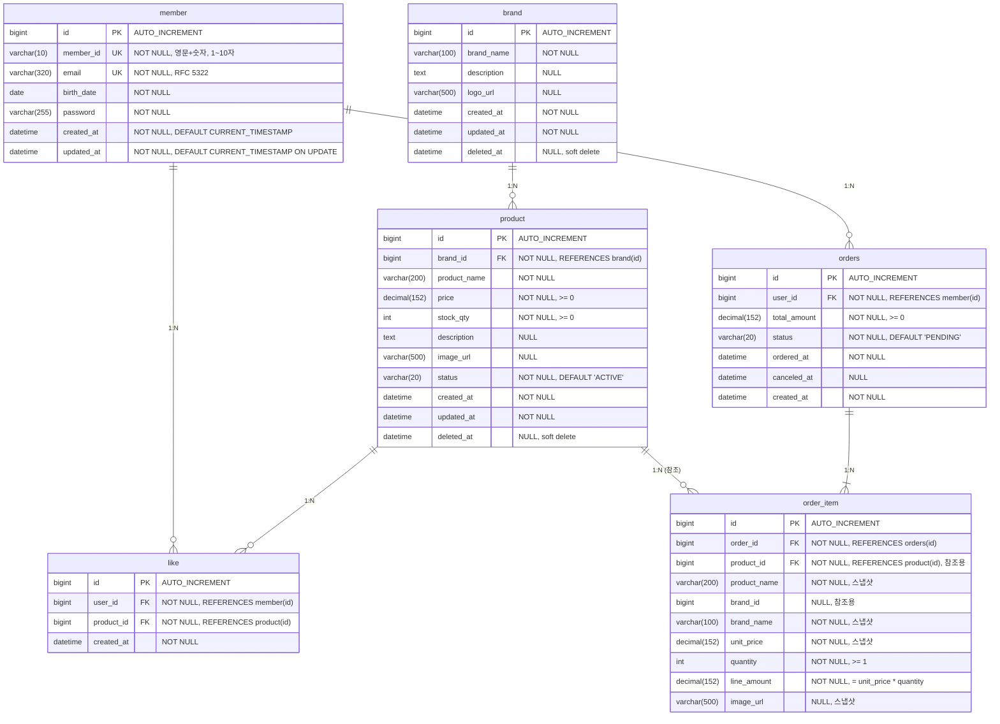

# ERD (Entity Relationship Diagram)

## 개요

이 문서는 데이터베이스 설계를 정의한다. ERD는 **테이블 구조**, **제약 조건**, **인덱스 후보**, **상태/삭제 정책**을 포함하며, 요구사항에서 도출된 **핵심 조회 패턴**을 기반으로 검증한다.

**핵심 조회 패턴** (인덱스 설계 근거):
1. 상품 목록 조회 (brandId 필터, 정렬, soft delete 필터)
2. 좋아요한 상품 목록 조회 (userId 필터)
3. 주문 목록 조회 (userId 필터, 기간 필터)

---

## 전체 ERD

### 검증 목적
테이블 간 **FK 관계**, **UNIQUE 제약**, **soft delete** 컬럼이 요구사항과 일치하는지 확인한다. 특히 order_item의 **스냅샷 컬럼**이 product/brand 삭제에 독립적인지 검증한다.

### 다이어그램



### 해석
- **Soft Delete**: brand, product 테이블에 `deleted_at` 컬럼 존재. 삭제 시 `deleted_at = NOW()` UPDATE.
- **스냅샷**: order_item이 product_name, brand_name, unit_price 등을 저장하여 product/brand 삭제에 독립적.
- **FK 관계**: product → brand, like → member/product, orders → member, order_item → orders/product (참조용).
- **UNIQUE 제약**: like 테이블에 (user_id, product_id) UNIQUE (다이어그램에서 명시 필요).

---

## 테이블 상세 설계

### 1. member (이미 구현됨)

이 테이블은 이번 설계 범위 밖이지만, 참조 무결성을 위해 명시한다.

| 컬럼 | 타입 | 제약 | 설명 |
|------|------|------|------|
| id | BIGINT | PK, AUTO_INCREMENT | 회원 ID |
| member_id | VARCHAR(10) | NOT NULL, UNIQUE | 로그인 ID (영문+숫자, 1~10자) |
| email | VARCHAR(320) | NOT NULL, UNIQUE | 이메일 (RFC 5322) |
| birth_date | DATE | NOT NULL | 생년월일 |
| password | VARCHAR(255) | NOT NULL | 비밀번호 해시 |
| created_at | DATETIME | NOT NULL, DEFAULT CURRENT_TIMESTAMP | 생성 일시 |
| updated_at | DATETIME | NOT NULL, DEFAULT CURRENT_TIMESTAMP ON UPDATE CURRENT_TIMESTAMP | 수정 일시 |

**제약**:
- PK: `id`

---

### 2. brand

| 컬럼 | 타입 | 제약 | 설명 |
|------|------|------|------|
| id | BIGINT | PK, AUTO_INCREMENT | 브랜드 ID |
| brand_name | VARCHAR(100) | NOT NULL | 브랜드명 |
| description | TEXT | NULL | 브랜드 설명 |
| logo_url | VARCHAR(500) | NULL | 로고 이미지 URL |
| created_at | DATETIME | NOT NULL | 생성 일시 |
| updated_at | DATETIME | NOT NULL | 수정 일시 |
| deleted_at | DATETIME | NULL | 삭제 일시 (soft delete) |

**제약**:
- PK: `id`

**삭제 정책**:
- Soft Delete: `deleted_at = NOW()`
- 연쇄 삭제: brand 삭제 시 product도 soft delete 처리 (애플리케이션 레벨)

---

### 3. product

| 컬럼 | 타입 | 제약 | 설명 |
|------|------|------|------|
| id | BIGINT | PK, AUTO_INCREMENT | 상품 ID |
| brand_id | BIGINT | NOT NULL | 브랜드 ID |
| product_name | VARCHAR(200) | NOT NULL | 상품명 |
| price | DECIMAL(15,2) | NOT NULL, CHECK (price >= 0) | 가격 |
| stock_qty | INT | NOT NULL, CHECK (stock_qty >= 0) | 재고 수량 |
| description | TEXT | NULL | 상품 설명 |
| image_url | VARCHAR(500) | NULL | 상품 이미지 URL |
| status | VARCHAR(20) | NOT NULL, DEFAULT 'ACTIVE' | 상품 상태 (ACTIVE/INACTIVE/OUT_OF_STOCK) |
| created_at | DATETIME | NOT NULL | 생성 일시 |
| updated_at | DATETIME | NOT NULL | 수정 일시 (latest 정렬 기준) |
| deleted_at | DATETIME | NULL | 삭제 일시 (soft delete) |

**제약**:
- PK: `id`
- FK: `brand_id` REFERENCES `brand(id)`
- CHECK: `price >= 0`, `stock_qty >= 0`

**재고 차감 동시성 제어**:
- 조건부 원자 UPDATE:
  ```sql
  UPDATE product
  SET stock_qty = stock_qty - :quantity, updated_at = NOW()
  WHERE id = :productId
    AND deleted_at IS NULL
    AND stock_qty >= :quantity;
  ```
- affected rows = 0이면 재고 부족 또는 삭제된 상품

**삭제 정책**:
- Soft Delete: `deleted_at = NOW()`
- 조회 필터: 모든 조회 쿼리에 `deleted_at IS NULL` 조건 필수

---

### 4. like

| 컬럼 | 타입 | 제약 | 설명 |
|------|------|------|------|
| id | BIGINT | PK, AUTO_INCREMENT | 좋아요 ID |
| user_id | BIGINT | NOT NULL | 사용자 ID |
| product_id | BIGINT | NOT NULL | 상품 ID |
| created_at | DATETIME | NOT NULL | 좋아요 일시 |

**제약**:
- PK: `id`
- UK: `(user_id, product_id)` (중복 좋아요 방지)
- FK: `user_id` REFERENCES `member(id)`
- FK: `product_id` REFERENCES `product(id)`

**멱등성**:
- INSERT 시 UNIQUE 제약 위반 catch → 성공 처리
- DELETE 시 affected rows = 0 → 성공 처리

**좋아요 수 집계**:
- Phase 1: `SELECT COUNT(*) FROM like WHERE product_id = ?`
- Phase 2 (병목 시): product.like_count 컬럼 도입 (별도 DDL 필요)

---

### 5. orders

| 컬럼 | 타입 | 제약 | 설명 |
|------|------|------|------|
| id | BIGINT | PK, AUTO_INCREMENT | 주문 ID |
| user_id | BIGINT | NOT NULL | 사용자 ID |
| total_amount | DECIMAL(15,2) | NOT NULL, CHECK (total_amount >= 0) | 총 주문 금액 |
| status | VARCHAR(20) | NOT NULL, DEFAULT 'PENDING' | 주문 상태 (PENDING/CANCELED) |
| ordered_at | DATETIME | NOT NULL | 주문 일시 |
| canceled_at | DATETIME | NULL | 취소 일시 |
| created_at | DATETIME | NOT NULL | 생성 일시 |

**제약**:
- PK: `id`
- FK: `user_id` REFERENCES `member(id)`
- CHECK: `total_amount >= 0`

**상태 전이**:
- PENDING → CANCELED (주문 취소)
- 추후 확장: PENDING → PAID → SHIPPED → COMPLETED

**취소 정책**:
- status = PENDING인 경우에만 취소 가능
- 취소 시 canceled_at = NOW(), status = CANCELED
- 재고 복구: order_item 기반으로 product.stock_qty += quantity

---

### 6. order_item

| 컬럼 | 타입 | 제약 | 설명 |
|------|------|------|------|
| id | BIGINT | PK, AUTO_INCREMENT | 주문 항목 ID |
| order_id | BIGINT | NOT NULL | 주문 ID |
| product_id | BIGINT | NOT NULL | 상품 ID (참조용) |
| product_name | VARCHAR(200) | NOT NULL | 상품명 (스냅샷) |
| brand_id | BIGINT | NULL | 브랜드 ID (참조용) |
| brand_name | VARCHAR(100) | NOT NULL | 브랜드명 (스냅샷) |
| unit_price | DECIMAL(15,2) | NOT NULL | 단가 (스냅샷) |
| quantity | INT | NOT NULL, CHECK (quantity >= 1) | 수량 |
| line_amount | DECIMAL(15,2) | NOT NULL | 행 금액 (= unit_price × quantity) |
| image_url | VARCHAR(500) | NULL | 상품 이미지 URL (스냅샷) |

**제약**:
- PK: `id`
- FK: `order_id` REFERENCES `orders(id)` ON DELETE CASCADE
- FK: `product_id` REFERENCES `product(id)` (참조용, ON DELETE RESTRICT 또는 SET NULL 고려)
- CHECK: `quantity >= 1`

**스냅샷 정책**:
- **저장 필드**: product_name, brand_name, unit_price, quantity, line_amount, image_url
- **참조 필드**: product_id, brand_id (조인 최소화, 삭제 후에도 조회 가능)
- **제외 필드**: description (최소 스냅샷 원칙)

**삭제 정책**:
- product 삭제 시: order_item.product_id는 유지 (FK ON DELETE RESTRICT 또는 SET NULL)
- 스냅샷 덕분에 product 삭제 후에도 주문 조회 가능

---

## 제약 조건 요약

### UNIQUE 제약
| 테이블 | 컬럼 | 목적 |
|--------|------|------|
| member | member_id | 중복 로그인 ID 방지 |
| member | email | 중복 이메일 방지 |
| like | (user_id, product_id) | 중복 좋아요 방지 |

### FK 제약
| 자식 테이블 | 부모 테이블 | 삭제 정책 |
|-----------|-----------|----------|
| product | brand | RESTRICT (애플리케이션 레벨 soft delete) |
| like | member | CASCADE 또는 RESTRICT |
| like | product | CASCADE 또는 RESTRICT |
| orders | member | RESTRICT |
| order_item | orders | CASCADE |
| order_item | product | RESTRICT 또는 SET NULL |

### CHECK 제약
| 테이블 | 제약 | 목적 |
|--------|------|------|
| product | price >= 0 | 음수 가격 방지 |
| product | stock_qty >= 0 | 음수 재고 방지 |
| orders | total_amount >= 0 | 음수 금액 방지 |
| order_item | quantity >= 1 | 0 이하 수량 방지 |

---

## 인덱스 설계

### 인덱스 후보 우선순위

#### 1. 필수 인덱스 (P0)
- **product**: `(deleted_at, updated_at)` - latest 정렬 + soft delete 필터 (가장 빈번한 조회)
- **product**: `(brand_id, deleted_at)` - 브랜드별 상품 조회
- **like**: `(user_id, product_id)` - UNIQUE 제약 + 좋아요 추가/취소
- **orders**: `(user_id, ordered_at)` - 사용자별 주문 목록 + 기간 필터
- **order_item**: `order_id` - 주문별 항목 조회

#### 2. 성능 개선 인덱스 (P1)
- **product**: `(deleted_at, price)` - price_asc 정렬 (사용 빈도 중간)
- **like**: `product_id` - 상품별 좋아요 수 집계 (likes_desc 정렬 시)
- **brand**: `deleted_at` - soft delete 필터링

#### 3. 확장 인덱스 (P2, 병목 시 고려)
- **product**: `like_count` - likes_desc 정렬 성능 개선 (컬럼 추가 필요)
- **order_item**: `product_id` - 상품별 주문 이력 조회 (어드민 분석용)

### 복합 인덱스 설계 근거
- **(deleted_at, updated_at)**: WHERE deleted_at IS NULL AND ORDER BY updated_at DESC
- **(brand_id, deleted_at)**: WHERE brand_id = ? AND deleted_at IS NULL
- **(user_id, ordered_at)**: WHERE user_id = ? AND ordered_at BETWEEN ? AND ? ORDER BY ordered_at DESC

---

## 상태 및 삭제 정책

### Soft Delete 정책
- **대상 테이블**: brand, product
- **구현**: `deleted_at DATETIME NULL`
- **삭제 동작**: `UPDATE {table} SET deleted_at = NOW() WHERE id = ?`
- **조회 필터**: 모든 SELECT 쿼리에 `deleted_at IS NULL` 조건 필수
- **연쇄 삭제**: brand 삭제 시 해당 brand_id의 모든 product도 soft delete (애플리케이션 레벨 트랜잭션)

### Hard Delete 대상
- **like**: 삭제 시 물리 삭제 (이력 불필요)
- **order/order_item**: 삭제하지 않음 (영구 보존)

### 상태 전이
- **product.status**: ACTIVE ↔ INACTIVE, ACTIVE → OUT_OF_STOCK
- **orders.status**: PENDING → CANCELED (이번 범위, 추후 확장 가능)

---

## 데이터 정합성 규칙

### 재고 일관성
- **강한 일관성**: 조건부 원자 UPDATE로 재고 음수 방지
- **동시성 제어**: WHERE stock_qty >= :quantity
- **데드락 방지**: productId 오름차순 정렬로 락 순서 고정

### 주문 스냅샷
- **불변성**: order_item은 생성 후 수정 불가 (INSERT만)
- **독립성**: product/brand 삭제 후에도 order_item 조회 가능

### 좋아요 중복 방지
- **DB 레벨**: UNIQUE (user_id, product_id)
- **애플리케이션 레벨**: DuplicateKeyException catch → 멱등 성공

---

## 성능 최적화 고려사항

### 1. 좋아요 수 집계 (likes_desc 정렬)
- **Phase 1**: COUNT 서브쿼리 (정확성 우선)
  ```sql
  SELECT p.*, (SELECT COUNT(*) FROM like WHERE product_id = p.id) AS like_count
  FROM product p
  WHERE deleted_at IS NULL
  ORDER BY like_count DESC;
  ```
- **Phase 2**: like_count 컬럼 도입 (성능 우선)
  - DDL: `ALTER TABLE product ADD COLUMN like_count INT NOT NULL DEFAULT 0;`
  - 집계: INSERT/DELETE like 시 +1/-1 (약한 일관성 허용)
  - 인덱스: `(deleted_at, like_count)`

### 2. Soft Delete 필터 성능
- **문제**: deleted_at IS NULL 조건이 모든 쿼리에 필요
- **완화**: deleted_at에 인덱스 생성, 또는 복합 인덱스 활용
- **JPA 전역 필터**: `@Where(clause = "deleted_at IS NULL")` 또는 QueryDSL BooleanExpression

### 3. 주문 목록 조회 성능
- **인덱스**: (user_id, ordered_at)로 기간 필터 + 정렬 최적화
- **페이징**: LIMIT/OFFSET 또는 Cursor 기반 페이징

---

## DDL 예시

### product 테이블

```sql
CREATE TABLE product (
    id BIGINT AUTO_INCREMENT PRIMARY KEY,
    brand_id BIGINT NOT NULL,
    product_name VARCHAR(200) NOT NULL,
    price DECIMAL(15,2) NOT NULL CHECK (price >= 0),
    stock_qty INT NOT NULL CHECK (stock_qty >= 0),
    description TEXT,
    image_url VARCHAR(500),
    status VARCHAR(20) NOT NULL DEFAULT 'ACTIVE',
    created_at DATETIME NOT NULL DEFAULT CURRENT_TIMESTAMP,
    updated_at DATETIME NOT NULL DEFAULT CURRENT_TIMESTAMP ON UPDATE CURRENT_TIMESTAMP,
    deleted_at DATETIME
) ENGINE=InnoDB DEFAULT CHARSET=utf8mb4 COLLATE=utf8mb4_unicode_ci;
```

### like 테이블

```sql
CREATE TABLE `like` (
    id BIGINT AUTO_INCREMENT PRIMARY KEY,
    user_id BIGINT NOT NULL,
    product_id BIGINT NOT NULL,
    created_at DATETIME NOT NULL DEFAULT CURRENT_TIMESTAMP,
    UNIQUE KEY uk_user_product (user_id, product_id)
) ENGINE=InnoDB DEFAULT CHARSET=utf8mb4 COLLATE=utf8mb4_unicode_ci;
```

### order_item 테이블

```sql
CREATE TABLE order_item (
    id BIGINT AUTO_INCREMENT PRIMARY KEY,
    order_id BIGINT NOT NULL,
    product_id BIGINT NOT NULL,
    product_name VARCHAR(200) NOT NULL,
    brand_id BIGINT,
    brand_name VARCHAR(100) NOT NULL,
    unit_price DECIMAL(15,2) NOT NULL,
    quantity INT NOT NULL CHECK (quantity >= 1),
    line_amount DECIMAL(15,2) NOT NULL,
    image_url VARCHAR(500)
) ENGINE=InnoDB DEFAULT CHARSET=utf8mb4 COLLATE=utf8mb4_unicode_ci;
```

---

## 확장 고려사항

### 1. 좋아요 수 캐싱 (Phase 2)
- **컬럼 추가**: `ALTER TABLE product ADD COLUMN like_count INT NOT NULL DEFAULT 0;`
- **동기화**: like INSERT/DELETE 시 product.like_count +1/-1
- **정합성**: 약한 일관성 허용 (Eventual Consistency)

### 2. 주문 상태 확장
- **현재**: PENDING, CANCELED
- **확장**: PAID, SHIPPED, COMPLETED, REFUNDED
- **전이 규칙**: 상태 다이어그램 정의 필요

### 3. 상품 이력 (History Table)
- **목적**: 가격 변경 이력 추적
- **테이블**: product_history (product_id, price, changed_at)
- **트리거**: product UPDATE 시 이력 INSERT