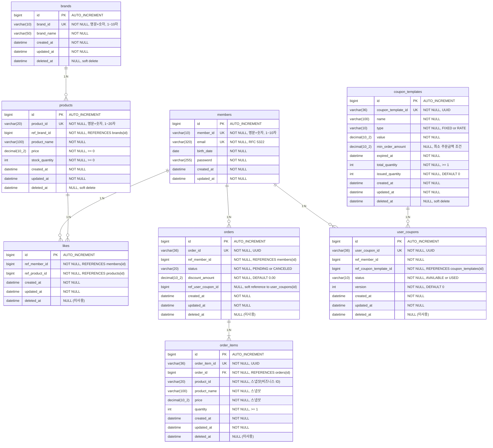

# ERD (Entity Relationship Diagram)

## 개요

이 문서는 데이터베이스 설계를 정의한다. ERD는 **실제 구현된 테이블 구조**, **제약 조건**, **인덱스 후보**, **상태/삭제 정책**을 포함하며, 요구사항에서 도출된 **핵심 조회 패턴**을 기반으로 검증한다.

**핵심 조회 패턴** (인덱스 설계 근거):
1. 상품 목록 조회 (ref_brand_id 필터, 정렬, soft delete 필터)
2. 좋아요 수 집계 (ref_product_id 기반 COUNT)
3. 주문 목록 조회 (ref_member_id 필터)

---

## 전체 ERD

### 검증 목적
테이블 간 **FK 관계**, **UNIQUE 제약**, **soft delete** 컬럼이 요구사항과 일치하는지 확인한다. 특히 order_items의 **스냅샷 컬럼**이 products/brands 삭제에 독립적인지 검증한다.

### 다이어그램



### 해석
- **Soft Delete**: brands, products, coupon_templates 테이블에 `deleted_at` 컬럼 존재. 삭제 시 `deleted_at = NOW()` UPDATE.
- **스냅샷**: order_items가 product_id(비즈니스 ID), product_name, price를 저장하여 products 삭제에 독립적.
- **BaseEntity 상속**: created_at, updated_at, deleted_at 컬럼은 모든 테이블에 포함 (JPA BaseEntity 상속).
- **likes 테이블**: ref_member_id, ref_product_id로 members/products를 간접 참조. Hard delete (물리 삭제).
- **orders/order_items**: 삭제 없음 (영구 보존). cascade로 order_items는 orders와 함께 관리.
- **coupon_templates**: 쿠폰 발급 기준 정의. issued_quantity는 동시성 제어(비관적 락)로 업데이트.
- **user_coupons**: 발급된 쿠폰 인스턴스. status는 AVAILABLE/USED만 DB 저장, EXPIRED는 응답 시 동적 계산.
- **orders.ref_user_coupon_id**: 쿠폰 적용 주문 추적용 소프트 참조 (FK 제약 없음). 주문 취소 시 쿠폰 복원에 사용.

---

## 테이블 상세 설계

### 1. members (이미 구현됨)

이 테이블은 이번 설계 범위 밖이지만, 참조 무결성을 위해 명시한다.

| 컬럼 | 타입 | 제약 | 설명 |
|------|------|------|------|
| id | BIGINT | PK, AUTO_INCREMENT | 시스템 ID |
| member_id | VARCHAR(10) | NOT NULL, UNIQUE | 로그인 ID (영문+숫자, 1~10자) |
| email | VARCHAR(320) | NOT NULL, UNIQUE | 이메일 (RFC 5322) |
| birth_date | DATE | NOT NULL | 생년월일 |
| password | VARCHAR(255) | NOT NULL | 비밀번호 해시 |
| created_at | DATETIME | NOT NULL | 생성 일시 |
| updated_at | DATETIME | NOT NULL | 수정 일시 |

---

### 2. brands

| 컬럼 | 타입 | 제약 | 설명 |
|------|------|------|------|
| id | BIGINT | PK, AUTO_INCREMENT | 시스템 ID |
| brand_id | VARCHAR(10) | NOT NULL, UNIQUE | 브랜드 비즈니스 ID (영문+숫자, 1~10자) |
| brand_name | VARCHAR(50) | NOT NULL | 브랜드명 |
| created_at | DATETIME | NOT NULL | 생성 일시 |
| updated_at | DATETIME | NOT NULL | 수정 일시 |
| deleted_at | DATETIME | NULL | 삭제 일시 (soft delete) |

**제약**:
- PK: `id`
- UK: `brand_id`

**삭제 정책**:
- Soft Delete: `deleted_at = NOW()`
- 연쇄 삭제: brand 삭제 시 products도 soft delete 처리 (애플리케이션 레벨 트랜잭션)

---

### 3. products

| 컬럼 | 타입 | 제약 | 설명 |
|------|------|------|------|
| id | BIGINT | PK, AUTO_INCREMENT | 시스템 ID |
| product_id | VARCHAR(20) | NOT NULL, UNIQUE | 상품 비즈니스 ID (영문+숫자, 1~20자) |
| ref_brand_id | BIGINT | NOT NULL | 브랜드 시스템 ID 참조 |
| product_name | VARCHAR(100) | NOT NULL | 상품명 |
| price | DECIMAL(10,2) | NOT NULL, >= 0 | 가격 |
| stock_quantity | INT | NOT NULL, >= 0 | 재고 수량 |
| created_at | DATETIME | NOT NULL | 생성 일시 |
| updated_at | DATETIME | NOT NULL | 수정 일시 (latest 정렬 기준) |
| deleted_at | DATETIME | NULL | 삭제 일시 (soft delete) |

**제약**:
- PK: `id`
- UK: `product_id`
- FK: `ref_brand_id` → `brands(id)`

**재고 차감 동시성 제어 (비관적 락)**:
```sql
-- 1단계: 비관적 락 획득 (트랜잭션 내)
SELECT * FROM products WHERE id = :productId FOR UPDATE;

-- 2단계: 애플리케이션 레이어에서 재고 검증
-- product.stockQuantity < quantity → throw CONFLICT

-- 3단계: 재고 차감
UPDATE products
SET stock_quantity = stock_quantity - :quantity
WHERE id = :productId;
```
- `SELECT ... FOR UPDATE`로 행 잠금 → 검증 → 차감이 원자적으로 실행
- productId 오름차순 정렬로 락 획득 순서 고정 (데드락 방지)

**삭제 정책**:
- Soft Delete: `deleted_at = NOW()`
- 조회 필터: 모든 SELECT 쿼리에 `deleted_at IS NULL` 조건 필수

---

### 4. likes

| 컬럼 | 타입 | 제약 | 설명 |
|------|------|------|------|
| id | BIGINT | PK, AUTO_INCREMENT | 시스템 ID |
| ref_member_id | BIGINT | NOT NULL | 회원 시스템 ID 참조 |
| ref_product_id | BIGINT | NOT NULL | 상품 시스템 ID 참조 |
| created_at | DATETIME | NOT NULL | 좋아요 일시 |
| updated_at | DATETIME | NOT NULL | 수정 일시 |
| deleted_at | DATETIME | NULL | 미사용 (hard delete) |

**제약**:
- PK: `id`
- UK: `uk_likes_member_product(ref_member_id, ref_product_id)` — 중복 좋아요 방지

**멱등성 (동시성 전략)**:
- 락 없음: 좋아요는 경합이 낮고 1건 중복은 비즈니스적으로 치명적이지 않음
- 선조회로 중복 확인 후 INSERT 시도
- 동시 요청으로 UNIQUE 위반 시: `DataIntegrityViolationException` catch → 재조회 → 멱등 성공
- DELETE 시 affected rows = 0 → 성공 처리

**좋아요 수 집계**:
- Phase 1 (현재): `SELECT COUNT(*) FROM likes WHERE ref_product_id = :productId`
- Phase 2 (병목 시): products.like_count 컬럼 도입 (별도 DDL 필요)

---

### 5. coupon_templates (신규)

| 컬럼 | 타입 | 제약 | 설명 |
|------|------|------|------|
| id | BIGINT | PK, AUTO_INCREMENT | 시스템 ID |
| coupon_template_id | VARCHAR(36) | NOT NULL, UNIQUE | 쿠폰 템플릿 UUID |
| name | VARCHAR(100) | NOT NULL | 쿠폰 이름 |
| type | VARCHAR(10) | NOT NULL | 쿠폰 타입 (FIXED/RATE) |
| value | DECIMAL(10,2) | NOT NULL | 할인 값 (FIXED: 원, RATE: %) |
| min_order_amount | DECIMAL(10,2) | NULL | 최소 주문금액 조건 (NULL = 조건 없음) |
| expired_at | DATETIME | NOT NULL | 만료 일시 |
| total_quantity | INT | NOT NULL | 총 발급 가능 수량 |
| issued_quantity | INT | NOT NULL, DEFAULT 0 | 현재까지 발급된 수량 |
| created_at | DATETIME | NOT NULL | 생성 일시 |
| updated_at | DATETIME | NOT NULL | 수정 일시 |
| deleted_at | DATETIME | NULL | 삭제 일시 (soft delete) |

**제약**:
- PK: `id`
- UK: `coupon_template_id`

**쿠폰 발급 동시성 제어 (비관적 락)**:
```sql
-- 비관적 락으로 issued_quantity 업데이트
SELECT * FROM coupon_templates WHERE coupon_template_id = :id FOR UPDATE;
-- 검증: issued_quantity < total_quantity
UPDATE coupon_templates SET issued_quantity = issued_quantity + 1 WHERE id = :id;
```

**삭제 정책**: Soft Delete (`deleted_at = NOW()`)

---

### 6. user_coupons (신규)

| 컬럼 | 타입 | 제약 | 설명 |
|------|------|------|------|
| id | BIGINT | PK, AUTO_INCREMENT | 시스템 ID |
| user_coupon_id | VARCHAR(36) | NOT NULL, UNIQUE | 쿠폰 인스턴스 UUID |
| ref_member_id | BIGINT | NOT NULL | 회원 시스템 ID 참조 |
| ref_coupon_template_id | BIGINT | NOT NULL | 쿠폰 템플릿 시스템 ID (FK) |
| status | VARCHAR(10) | NOT NULL, DEFAULT 'AVAILABLE' | 쿠폰 상태 (AVAILABLE/USED) |
| version | INT | NOT NULL, DEFAULT 0 | 낙관적 락 버전 (@Version) |
| created_at | DATETIME | NOT NULL | 발급 일시 |
| updated_at | DATETIME | NOT NULL | 수정 일시 |
| deleted_at | DATETIME | NULL | 미사용 |

**제약**:
- PK: `id`
- UK: `user_coupon_id`
- UK: `(ref_member_id, ref_coupon_template_id)` — 중복 발급 방지
- FK: `ref_coupon_template_id` → `coupon_templates(id)`

**쿠폰 사용 동시성 제어 (조건부 UPDATE)**:
```sql
-- 조건부 UPDATE: rowsAffected == 0이면 이미 사용됨
UPDATE user_coupons
SET status = 'USED', version = version + 1
WHERE id = :id AND status = 'AVAILABLE';

-- 쿠폰 복원 (주문 취소 시, idempotent)
UPDATE user_coupons
SET status = 'AVAILABLE', version = version + 1
WHERE id = :id AND status = 'USED';
```

**EXPIRED 상태**:
- DB에 저장하지 않음 (불필요한 스캔 방지)
- 응답 시 `coupon_template.expired_at < now()` 조건으로 동적 계산

---

### 7. orders

| 컬럼 | 타입 | 제약 | 설명 |
|------|------|------|------|
| id | BIGINT | PK, AUTO_INCREMENT | 시스템 ID |
| order_id | VARCHAR(36) | NOT NULL, UNIQUE | 주문 UUID (비즈니스 ID) |
| ref_member_id | BIGINT | NOT NULL | 회원 시스템 ID 참조 |
| status | VARCHAR(20) | NOT NULL | 주문 상태 (PENDING/CANCELED) |
| discount_amount | DECIMAL(10,2) | NOT NULL, DEFAULT 0.00 | 쿠폰 할인 금액 |
| ref_user_coupon_id | BIGINT | NULL | 적용된 쿠폰 ID (soft ref, no FK) |
| created_at | DATETIME | NOT NULL | 생성 일시 (= 주문 일시) |
| updated_at | DATETIME | NOT NULL | 수정 일시 (= 취소 일시) |
| deleted_at | DATETIME | NULL | 미사용 (영구 보존) |

**제약**:
- PK: `id`
- UK: `order_id`
- FK: `ref_member_id` → `members(id)`
- `ref_user_coupon_id`: FK 제약 없음 (soft reference, 쿠폰 삭제 시 주문 이력 보존)

**상태 전이**:
- `PENDING → CANCELED` (주문 취소)
- CANCELED 상태에서 cancel() 호출 시 멱등 성공 (예외 없음)

**취소 정책**:
- PENDING 상태인 경우만 취소 가능 (도메인 OrderStatus.validateTransition)
- 취소 시 order_items 기반으로 products.stock_quantity 복구
- 취소 시 ref_user_coupon_id가 있으면 user_coupons.status USED→AVAILABLE 복원

---

### 8. order_items

| 컬럼 | 타입 | 제약 | 설명 |
|------|------|------|------|
| id | BIGINT | PK, AUTO_INCREMENT | 시스템 ID |
| order_item_id | VARCHAR(36) | NOT NULL, UNIQUE | 주문항목 UUID (비즈니스 ID) |
| order_id | BIGINT | NOT NULL | 주문 시스템 ID (FK) |
| product_id | VARCHAR(20) | NOT NULL | 상품 비즈니스 ID (스냅샷) |
| product_name | VARCHAR(100) | NOT NULL | 상품명 (스냅샷) |
| price | DECIMAL(10,2) | NOT NULL | 단가 (스냅샷) |
| quantity | INT | NOT NULL, >= 1 | 수량 |
| created_at | DATETIME | NOT NULL | 생성 일시 |
| updated_at | DATETIME | NOT NULL | 수정 일시 |
| deleted_at | DATETIME | NULL | 미사용 |

**제약**:
- PK: `id`
- UK: `order_item_id`
- FK: `order_id` → `orders(id)` ON DELETE CASCADE

**스냅샷 정책**:
- **저장 필드**: product_id(비즈니스 ID), product_name, price, quantity
- **총액 계산**: `price × quantity` (getTotalPrice() 메서드 - DB 컬럼 없음)
- **제외 필드**: brand_name, image_url (최소 스냅샷 원칙)
- 스냅샷이므로 product 삭제/수정 후에도 주문 이력 조회 가능

---

## 제약 조건 요약

### UNIQUE 제약

| 테이블 | 제약명 | 컬럼 | 목적 |
|--------|--------|------|------|
| members | - | member_id | 중복 로그인 ID 방지 |
| members | - | email | 중복 이메일 방지 |
| brands | - | brand_id | 중복 브랜드 ID 방지 |
| products | - | product_id | 중복 상품 ID 방지 |
| likes | uk_likes_member_product | (ref_member_id, ref_product_id) | 중복 좋아요 방지 |
| coupon_templates | uk_coupon_template_id | coupon_template_id | 중복 쿠폰 템플릿 ID 방지 |
| user_coupons | uk_user_coupon_id | user_coupon_id | 중복 쿠폰 ID 방지 |
| user_coupons | uk_user_coupon_member_template | (ref_member_id, ref_coupon_template_id) | 중복 발급 방지 |
| orders | - | order_id | 중복 주문 ID 방지 |
| order_items | - | order_item_id | 중복 주문항목 ID 방지 |

### FK 제약

| 자식 테이블 | 컬럼 | 부모 테이블 | 삭제 정책 |
|-----------|------|-----------|----------|
| products | ref_brand_id | brands(id) | RESTRICT (애플리케이션 레벨 soft delete) |
| likes | ref_member_id | members(id) | RESTRICT |
| likes | ref_product_id | products(id) | RESTRICT |
| user_coupons | ref_coupon_template_id | coupon_templates(id) | RESTRICT |
| orders | ref_member_id | members(id) | RESTRICT |
| orders | ref_user_coupon_id | (없음, soft ref) | — FK 제약 없음 |
| order_items | order_id | orders(id) | CASCADE |

### CHECK 제약

| 테이블 | 제약 | 목적 |
|--------|------|------|
| products | price >= 0 | 음수 가격 방지 |
| products | stock_quantity >= 0 | 음수 재고 방지 |
| order_items | quantity >= 1 | 0 이하 수량 방지 |

---

## 인덱스 설계

### 인덱스 후보 우선순위

#### 1. 필수 인덱스 (P0)
- **products**: `(deleted_at, updated_at)` — latest 정렬 + soft delete 필터
- **products**: `(ref_brand_id, deleted_at)` — 브랜드별 상품 조회
- **likes**: `(ref_member_id, ref_product_id)` — UNIQUE 제약 (자동 인덱스)
- **likes**: `ref_product_id` — 상품별 좋아요 수 집계
- **order_items**: `order_id` — 주문별 항목 조회

#### 2. 성능 개선 인덱스 (P1)
- **products**: `(deleted_at, price)` — price_asc 정렬
- **brands**: `deleted_at` — soft delete 필터링
- **orders**: `ref_member_id` — 사용자별 주문 목록

#### 3. 확장 인덱스 (P2, 병목 시 고려)
- **products**: `like_count` — likes_desc 정렬 성능 개선 (컬럼 추가 필요)

### 복합 인덱스 설계 근거
- `(deleted_at, updated_at)`: `WHERE deleted_at IS NULL ORDER BY updated_at DESC`
- `(ref_brand_id, deleted_at)`: `WHERE ref_brand_id = ? AND deleted_at IS NULL`
- `(ref_member_id, ref_product_id)`: UNIQUE 제약이므로 자동 생성

---

## 상태 및 삭제 정책

### Soft Delete 정책
- **대상 테이블**: brands, products
- **구현**: `deleted_at DATETIME NULL` (BaseEntity 상속)
- **삭제 동작**: `markAsDeleted()` → `delete()` → `deletedAt = LocalDateTime.now()`
- **조회 필터**: 모든 SELECT 쿼리에 `deleted_at IS NULL` 조건 필수
- **연쇄 삭제**: brand 삭제 시 해당 ref_brand_id의 모든 products도 soft delete (애플리케이션 트랜잭션)

### Hard Delete 대상
- **likes**: 물리 삭제 (이력 불필요, `likeRepository.delete(like)`)

### 삭제 없음 (영구 보존)
- **orders, order_items**: 주문 이력은 삭제하지 않음

### 상태 전이
- **orders.status**: `PENDING → CANCELED` (취소)

---

## 데이터 정합성 규칙

### 재고 일관성 (비관적 락)

```
전략: SELECT ... FOR UPDATE + 애플리케이션 검증 + UPDATE

트랜잭션 내 처리 순서:
1. 상품 목록을 productId 오름차순 정렬 (데드락 방지)
2. 각 상품에 대해:
   a. SELECT * FROM products WHERE id = :productId FOR UPDATE; (비관적 락)
   b. 재고 검증: stockQuantity >= requestedQuantity
   c. 재고 부족 → 예외 발생 → 트랜잭션 전체 롤백 (모든 락 해제)
   d. UPDATE products SET stock_quantity = stock_quantity - :qty WHERE id = :id;
3. OrderModel + OrderItemModel 저장
4. 트랜잭션 커밋 (모든 비관적 락 해제)

장점: 명시적 직렬화, 명확한 재고 검증 로직
단점: 락 보유 시간 증가, 높은 경합 시 처리량 감소
```

### 좋아요 중복 방지 (DB 제약)

```
전략: UNIQUE 제약 + 예외 catch (락 없음)

처리 순서:
1. findByRefMemberIdAndRefProductId 선조회
2. 없으면 INSERT 시도
3. DataIntegrityViolationException 발생 시 재조회하여 멱등 성공
4. 있으면 기존 반환

장점: 락 없음, 높은 처리량
단점: 동시 요청 시 예외 발생 후 재조회 오버헤드 (극히 드문 케이스)
```

### 주문 스냅샷 불변성
- order_items는 생성 후 수정 불가 (INSERT only)
- product/brand 삭제 후에도 주문 이력 조회 가능

---

## 성능 최적화 고려사항

### 1. 좋아요 수 집계 (likes_desc 정렬)

**Phase 1 (현재 구현)**: LEFT JOIN + COUNT
```sql
SELECT p.*
FROM products p
LEFT JOIN likes l ON p.id = l.ref_product_id
WHERE p.deleted_at IS NULL
[AND p.ref_brand_id = :refBrandId]
GROUP BY p.id
ORDER BY COUNT(l.id) DESC, p.updated_at DESC;
```

**Phase 2 (병목 시)**: like_count 컬럼 도입
```sql
ALTER TABLE products ADD COLUMN like_count INT NOT NULL DEFAULT 0;
-- like INSERT/DELETE 시 +1/-1 (약한 일관성 허용)
-- 인덱스: (deleted_at, like_count)
```

### 2. Soft Delete 필터 성능
- `deleted_at IS NULL` 조건이 모든 쿼리에 필요
- 복합 인덱스 `(deleted_at, 정렬컬럼)` 활용

### 3. Facade Enrichment N+1 주의
- 현재: 상품 목록에서 각 상품별 Brand 조회 + 좋아요 수 조회 (N+1 위험)
- 개선 방향: 단일 쿼리로 JOIN하여 통합 조회

---

## DDL 예시

### brands 테이블

```sql
CREATE TABLE brands (
    id BIGINT AUTO_INCREMENT PRIMARY KEY,
    brand_id VARCHAR(10) NOT NULL,
    brand_name VARCHAR(50) NOT NULL,
    created_at DATETIME NOT NULL DEFAULT CURRENT_TIMESTAMP,
    updated_at DATETIME NOT NULL DEFAULT CURRENT_TIMESTAMP ON UPDATE CURRENT_TIMESTAMP,
    deleted_at DATETIME,
    UNIQUE KEY uk_brand_id (brand_id)
) ENGINE=InnoDB DEFAULT CHARSET=utf8mb4 COLLATE=utf8mb4_unicode_ci;
```

### products 테이블

```sql
CREATE TABLE products (
    id BIGINT AUTO_INCREMENT PRIMARY KEY,
    product_id VARCHAR(20) NOT NULL,
    ref_brand_id BIGINT NOT NULL,
    product_name VARCHAR(100) NOT NULL,
    price DECIMAL(10,2) NOT NULL CHECK (price >= 0),
    stock_quantity INT NOT NULL CHECK (stock_quantity >= 0),
    created_at DATETIME NOT NULL DEFAULT CURRENT_TIMESTAMP,
    updated_at DATETIME NOT NULL DEFAULT CURRENT_TIMESTAMP ON UPDATE CURRENT_TIMESTAMP,
    deleted_at DATETIME,
    UNIQUE KEY uk_product_id (product_id),
    KEY idx_ref_brand_deleted (ref_brand_id, deleted_at),
    KEY idx_deleted_updated (deleted_at, updated_at)
) ENGINE=InnoDB DEFAULT CHARSET=utf8mb4 COLLATE=utf8mb4_unicode_ci;
```

### likes 테이블

```sql
CREATE TABLE likes (
    id BIGINT AUTO_INCREMENT PRIMARY KEY,
    ref_member_id BIGINT NOT NULL,
    ref_product_id BIGINT NOT NULL,
    created_at DATETIME NOT NULL DEFAULT CURRENT_TIMESTAMP,
    updated_at DATETIME NOT NULL DEFAULT CURRENT_TIMESTAMP ON UPDATE CURRENT_TIMESTAMP,
    deleted_at DATETIME,
    UNIQUE KEY uk_likes_member_product (ref_member_id, ref_product_id),
    KEY idx_ref_product_id (ref_product_id)
) ENGINE=InnoDB DEFAULT CHARSET=utf8mb4 COLLATE=utf8mb4_unicode_ci;
```

### coupon_templates 테이블 (신규)

```sql
CREATE TABLE coupon_templates (
    id                 BIGINT AUTO_INCREMENT PRIMARY KEY,
    coupon_template_id VARCHAR(36)   NOT NULL,
    name               VARCHAR(100)  NOT NULL,
    type               VARCHAR(10)   NOT NULL,           -- FIXED | RATE
    value              DECIMAL(10,2) NOT NULL,
    min_order_amount   DECIMAL(10,2),                   -- NULL = 최소금액 없음
    expired_at         DATETIME      NOT NULL,
    total_quantity     INT           NOT NULL,
    issued_quantity    INT           NOT NULL DEFAULT 0,
    created_at         DATETIME      NOT NULL DEFAULT CURRENT_TIMESTAMP,
    updated_at         DATETIME      NOT NULL DEFAULT CURRENT_TIMESTAMP ON UPDATE CURRENT_TIMESTAMP,
    deleted_at         DATETIME,
    UNIQUE KEY uk_coupon_template_id (coupon_template_id)
) ENGINE=InnoDB DEFAULT CHARSET=utf8mb4 COLLATE=utf8mb4_unicode_ci;
```

### user_coupons 테이블 (신규)

```sql
CREATE TABLE user_coupons (
    id                     BIGINT AUTO_INCREMENT PRIMARY KEY,
    user_coupon_id         VARCHAR(36) NOT NULL,
    ref_member_id          BIGINT      NOT NULL,
    ref_coupon_template_id BIGINT      NOT NULL,
    status                 VARCHAR(10) NOT NULL DEFAULT 'AVAILABLE',  -- AVAILABLE | USED
    version                INT         NOT NULL DEFAULT 0,
    created_at             DATETIME    NOT NULL DEFAULT CURRENT_TIMESTAMP,
    updated_at             DATETIME    NOT NULL DEFAULT CURRENT_TIMESTAMP ON UPDATE CURRENT_TIMESTAMP,
    deleted_at             DATETIME,
    UNIQUE KEY uk_user_coupon_id (user_coupon_id),
    UNIQUE KEY uk_user_coupon_member_template (ref_member_id, ref_coupon_template_id),
    KEY idx_ref_member_id (ref_member_id),
    CONSTRAINT fk_user_coupons_template FOREIGN KEY (ref_coupon_template_id)
        REFERENCES coupon_templates(id)
) ENGINE=InnoDB DEFAULT CHARSET=utf8mb4 COLLATE=utf8mb4_unicode_ci;
```

### orders 테이블

```sql
CREATE TABLE orders (
    id                  BIGINT AUTO_INCREMENT PRIMARY KEY,
    order_id            VARCHAR(36)   NOT NULL,
    ref_member_id       BIGINT        NOT NULL,
    status              VARCHAR(20)   NOT NULL DEFAULT 'PENDING',
    discount_amount     DECIMAL(10,2) NOT NULL DEFAULT 0.00,
    ref_user_coupon_id  BIGINT,                              -- NULL = 쿠폰 미적용
    created_at          DATETIME      NOT NULL DEFAULT CURRENT_TIMESTAMP,
    updated_at          DATETIME      NOT NULL DEFAULT CURRENT_TIMESTAMP ON UPDATE CURRENT_TIMESTAMP,
    deleted_at          DATETIME,
    UNIQUE KEY uk_order_id (order_id),
    KEY idx_ref_member_id (ref_member_id)
) ENGINE=InnoDB DEFAULT CHARSET=utf8mb4 COLLATE=utf8mb4_unicode_ci;
```

### order_items 테이블

```sql
CREATE TABLE order_items (
    id BIGINT AUTO_INCREMENT PRIMARY KEY,
    order_item_id VARCHAR(36) NOT NULL,
    order_id BIGINT NOT NULL,
    product_id VARCHAR(20) NOT NULL,
    product_name VARCHAR(100) NOT NULL,
    price DECIMAL(10,2) NOT NULL,
    quantity INT NOT NULL CHECK (quantity >= 1),
    created_at DATETIME NOT NULL DEFAULT CURRENT_TIMESTAMP,
    updated_at DATETIME NOT NULL DEFAULT CURRENT_TIMESTAMP ON UPDATE CURRENT_TIMESTAMP,
    deleted_at DATETIME,
    UNIQUE KEY uk_order_item_id (order_item_id),
    KEY idx_order_id (order_id),
    CONSTRAINT fk_order_items_order FOREIGN KEY (order_id) REFERENCES orders(id) ON DELETE CASCADE
) ENGINE=InnoDB DEFAULT CHARSET=utf8mb4 COLLATE=utf8mb4_unicode_ci;
```

---

## 확장 고려사항

### 1. 좋아요 수 캐싱 (Phase 2)
- **컬럼 추가**: `ALTER TABLE products ADD COLUMN like_count INT NOT NULL DEFAULT 0;`
- **동기화**: like INSERT/DELETE 시 products.like_count +1/-1
- **정합성**: 약한 일관성 허용 (Eventual Consistency)

### 2. 주문 상태 확장
- **현재**: PENDING, CANCELED
- **확장**: PAID, SHIPPED, COMPLETED, REFUNDED
- **전이 규칙**: OrderStatus.validateTransition에서 상태 다이어그램 정의

### 3. 재고 락 방식 전환 가능성
- **현재**: 비관적 락 (`SELECT ... FOR UPDATE`)
- **고트래픽 시 대안**: 낙관적 락 (`@Version`) 또는 Redis 분산 락
- **전환 시점**: 재고 차감 병목이 확인된 후 결정
