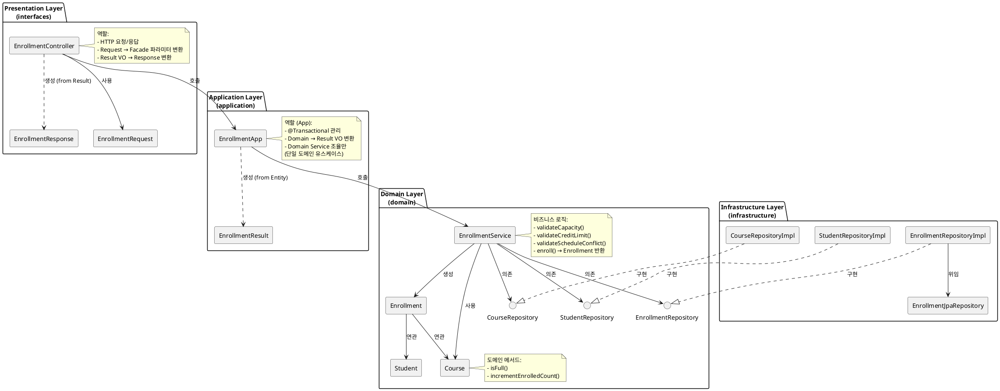
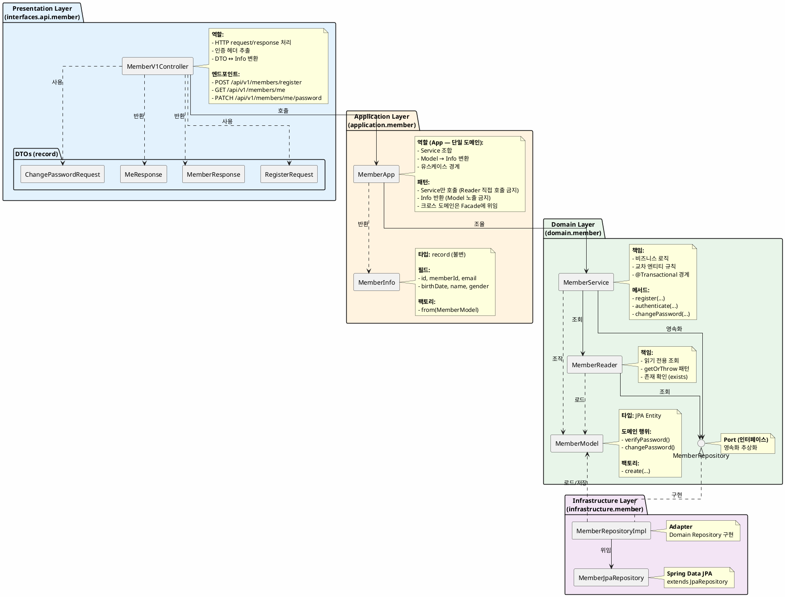

# 컴포넌트 다이어그램

## 개요

이 문서는 레이어드 아키텍처의 컴포넌트 구조와 의존성 관계를 PlantUML로 표현한다. 컴포넌트 다이어그램은 **패키지 구조**, **컴포넌트 책임**, **의존성 방향**을 중심으로 작성되며, 클래스 다이어그램(03-class-diagram.md)을 보완한다.

**핵심 검증 포인트**:
1. 레이어 간 의존성 방향 (Interfaces → Application → Domain ← Infrastructure)
2. 컴포넌트 간 결합도 (느슨한 결합, 인터페이스 기반)
3. 각 컴포넌트의 단일 책임 준수

**표기법**:
- `[Component]`: 컴포넌트 (클래스 또는 인터페이스)
- `-->`: 의존성 (사용 관계)
- `..>`: 약한 의존성 (생성, 반환)
- `..|>`: 구현 관계

---

## 예시: Enrollment 도메인 컴포넌트 다이어그램

다음은 Enrollment/Course/Student 도메인의 컴포넌트 다이어그램 예시이다. 이 패턴을 Member 도메인에 적용한다.



---

## Member 도메인 컴포넌트 다이어그램

### 검증 목적
Member 도메인의 레이어드 아키텍처 구조를 확인한다. Controller → App → Service → Repository 의존성 흐름이 명확히 드러나야 하며, App이 Service만 호출하고 Reader를 직접 호출하지 않는지 검증한다.

### 다이어그램



### 해석

**레이어 흐름**:
- **Controller**: HTTP 요청 수신 → App 호출 → Info 수신 → DTO 변환하여 응답
- **App**: Service 호출 → Model 수신 → Info 변환하여 반환 (단일 도메인 유스케이스)
- **Service**: 비즈니스 로직 실행 → Reader/Repository 사용 → Model 반환
- **Reader**: Repository 사용 → 조회 전용 → Model 반환
- **Repository**: 영속화 추상화 (Port)
- **RepositoryImpl**: Repository 구현 (Adapter) → JpaRepository 위임

**핵심 패턴**:
1. **App은 Service만 호출**: Reader를 직접 호출하지 않음 (Service가 Reader 소유)
2. **Info 변환**: App에서 Model → Info 변환 (레이어 격리)
3. **Port-Adapter**: Domain의 Repository(interface)를 Infrastructure의 RepositoryImpl이 구현
4. **DTO vs Info**: DTO는 HTTP 계층, Info는 Application 계층 (서로 다른 관심사)
5. **App vs Facade**: 단일 도메인은 App, 2개 이상 App 조합 시에만 Facade

---

## 설계 원칙

### 1. App / Facade Pattern (Application Layer)

**App 원칙 (기본 패턴)**:
- App은 단일 도메인 유스케이스를 담당
- Service만 호출, Reader 직접 호출 금지
- Model → Info 변환 담당
- Controller는 단일 도메인 처리 시 App을 직접 호출

**Facade 원칙 (크로스 도메인)**:
- Facade는 **2개 이상의 App**을 조합할 때만 사용
- App → App 의존은 금지이므로 크로스 도메인은 Facade 책임
- Facade는 Service를 직접 호출하지 않고 App 경유

**Info 변환**:
- App이 Model → Info 변환 담당 (레이어 격리)
- Controller는 Info를 알지만 Model은 모름
- Domain Model이 Presentation Layer에 노출되지 않음

**트랜잭션 경계**:
- App 메서드 또는 Facade 메서드가 @Transactional 경계
- 유스케이스 단위로 트랜잭션 관리

**변환 흐름**:
```
단일 도메인: Controller → App → Service → Repository
크로스 도메인: Controller → Facade → App(복수) → Service → Repository
```

---

### 2. DTO vs Info vs Model

| 타입 | 레이어 | 목적 | 특징 |
|-----|--------|------|------|
| **DTO** | Presentation | HTTP 요청/응답 | Jakarta Validation, record 타입 |
| **Info** | Application | 유스케이스 결과 | record 타입, 불변, from(Model) 팩토리 |
| **Model** | Domain | 도메인 엔티티 | JPA Entity, 도메인 행위 메서드 |

**분리 이유**:
- **DTO**: HTTP 프로토콜 의존 (헤더, 쿼리 파라미터 등)
- **Info**: 애플리케이션 유스케이스 결과 (도메인 독립적)
- **Model**: 비즈니스 규칙과 영속화 (인프라 독립적)

**변환 흐름**:
```
HTTP Request → DTO → Facade(파라미터) → Service
Service → Model → Facade → Info → Controller → DTO → HTTP Response
```

---

### 3. Repository Pattern (Port-Adapter)

**Port (인터페이스)**:
- Domain 레이어에 정의 (MemberRepository)
- 영속화 추상화 (기술 독립적)
- Domain이 Infrastructure를 의존하지 않음

**Adapter (구현체)**:
- Infrastructure 레이어에 구현 (MemberRepositoryImpl)
- JpaRepository에 위임
- JPA 기술 세부사항 캡슐화

**의존성 역전**:
```
Domain (Repository interface) <--- Infrastructure (RepositoryImpl)
```
- Domain이 Infrastructure를 모름
- Infrastructure가 Domain 인터페이스를 구현

---

### 4. Reader vs Service 분리

**Reader 책임**:
- 읽기 전용 조회
- getOrThrow 패턴 (조회 + 예외 통합)
- exists 체크

**Service 책임**:
- CUD (Create, Update, Delete)
- 비즈니스 규칙 (중복 체크, 검증)
- @Transactional 관리

**관계**:
- Service가 Reader를 의존 (Service가 Reader 소유)
- Facade는 Service만 호출 (Reader 직접 호출 금지)

---

## 레이어별 책임 정리

| 레이어 | 패키지 | 컴포넌트 | 책임 |
|--------|--------|----------|------|
| **Presentation** | interfaces.api.member | MemberV1Controller | HTTP 엔드포인트, 인증 헤더 추출, DTO ↔ Info 변환 |
| | | DTOs (record) | 요청/응답 데이터, Jakarta Validation |
| **Application** | application.member | MemberApp | 단일 도메인 유스케이스, Service 호출, Model → Info 변환 |
| | | (크로스 도메인 시) XxxFacade | 2개 이상 App 조합, 크로스 도메인 오케스트레이션 |
| | | MemberInfo (record) | 애플리케이션 결과 VO, 불변 |
| **Domain** | domain.member | MemberService | 비즈니스 로직, 트랜잭션 경계, 교차 엔티티 규칙 |
| | | MemberReader | 읽기 전용 조회, getOrThrow 패턴 |
| | | MemberModel | JPA Entity, 도메인 행위 메서드 (verifyPassword, changePassword) |
| | | MemberRepository (interface) | 영속화 추상화 (Port) |
| **Infrastructure** | infrastructure.member | MemberRepositoryImpl | Repository 구현 (Adapter) |
| | | MemberJpaRepository | Spring Data JPA, extends JpaRepository |

---

## 기존 다이어그램과의 관계

### 02-sequence-diagrams.md (시퀀스 다이어그램)
- **시퀀스**: 동적 흐름 (시간 순서, 메서드 호출 순서)
- **컴포넌트**: 정적 구조 (의존성 관계, 패키지 구조)
- **보완 관계**: 시퀀스는 "어떻게 동작하는가", 컴포넌트는 "어떻게 구성되는가"

### 03-class-diagram.md (클래스 다이어그램)
- **클래스**: 클래스 상세 (필드, 메서드, 타입)
- **컴포넌트**: 컴포넌트 책임 (레이어, 의존성, 역할)
- **보완 관계**: 클래스는 "무엇을 가지는가", 컴포넌트는 "왜 분리되는가"

### 04-erd.md (ERD)
- **ERD**: 데이터베이스 테이블 구조 (컬럼, FK, 인덱스)
- **컴포넌트**: 애플리케이션 레이어 구조 (컴포넌트, 의존성)
- **연결 고리**: Infrastructure 레이어의 JpaRepository가 ERD 테이블과 매핑

---

## 검증 체크리스트

- [x] 레이어 간 의존성 방향: Interfaces → Application → Domain ← Infrastructure
- [x] 단일 도메인 유스케이스는 App 사용 (Facade 금지)
- [x] Facade는 2개 이상의 App을 조합할 때만 사용
- [x] App은 Service만 호출 (Reader 직접 호출 금지)
- [x] Facade는 App만 호출 (Service 직접 호출 금지)
- [x] Info는 Application 레이어 (Model은 Domain 레이어)
- [x] Repository는 Domain에 정의 (Port), Infrastructure에 구현 (Adapter)
- [x] Controller는 Model을 모름 (Info만 알음)
- [x] 모든 컴포넌트가 단일 책임 원칙 준수

---

## 다음 단계

이 컴포넌트 다이어그램을 기반으로:
- **구현**: MemberApp, MemberInfo 구현
- **테스트**: App 단위 테스트 (Service 모킹)
- **확장**: 다른 도메인에도 동일한 패턴 적용 (Product, Order 등)
- **크로스 도메인**: 2개 이상 App 조합이 필요한 경우에만 Facade 추가
